# 

[ [English](README.md) | [中文](README.cn.md) | [Español](README.es.md) | [Français](README.fr.md) | [Italiano](README.it.md) | [日本語](README.ja.md) | [한국어](README.ko.md) | [Português](README.pt.md) | [Русский](README.ru.md) | [Deutsch](README.de.md)]

**Pyxel** ist eine Retro-Spielengine für Python.

Dank seiner einfachen, von Retro-Spielkonsolen inspirierten, Spezifikationen, wie z. B. dass nur 16 Farben angezeigt werden können und nur 4 Töne gleichzeitig wiedergegeben werden können, kannst du dich frei fühlen, um Spiele im Pixel-Art-Stil zu entwickeln.

<a href="pyxel/examples/01_hello_pyxel.py" target="_blank">
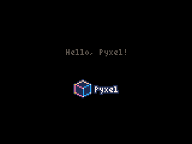
</a>

<a href="pyxel/examples/02_jump_game.py" target="_blank">
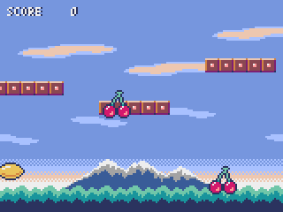
</a>

<a href="pyxel/examples/03_draw_api.py" target="_blank">
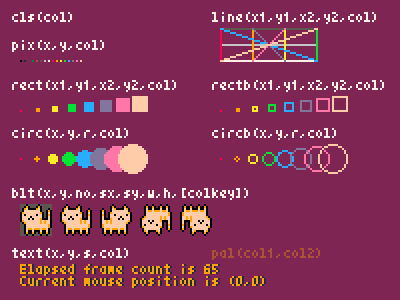
</a>

<a href="pyxel/examples/04_sound_api.py" target="_blank">
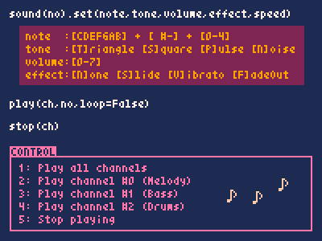
</a>

<a href="pyxel/editor/screenshots/image_tilemap_editor.gif" target="_blank">

</a>

<a href="pyxel/editor/screenshots/sound_music_editor.gif" target="_blank">
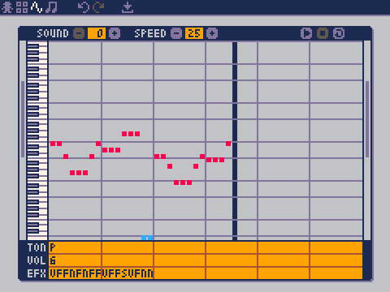
</a>

Die Spezifikationen der Spielkonsole und der APIs für Pyxel beziehen sich auf die großartigen [PICO-8] (https://www.lexaloffle.com/pico-8.php) und [TIC-80] (https://tic.computer/).

Pyxel ist quelloffen und kostenlos zu verwenden. Fang an, ein Retro-Spiel mit Pyxel zu entwickeln!

## Spezifikationen

- Läuft unter Windows, Mac, und Linux
- Code schreiben mit Python3
- Festgelegte 16-Farben-Palette
- 256x256 große 3 Image Banks
- 256x256 große 8 Tilemaps
- 4 Kanäle mit 64 definierbaren Tönen
- 8 Musikspuren, die beliebige Klänge kombinieren können
- Tastatur-, Maus- und Gamepad-Eingaben
- Bild- und Toneditor

### Farbpalette

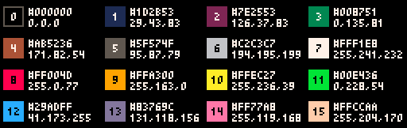
<br><br>


## Installationsanleitung

### Windows

Zuerst installiere [Python3](https://www.python.org/) (Version 3.6.8 oder höher).

Wenn du Python mit dem offiziellen Installationsprogramm installierst, klicke auf das Feld unten **Add Python to PATH**, 


Als nächstes installiere Pyxel mit dem `pip` Befehl in der Konsole:

```sh
pip install -U pyxel
```

### Mac

Installier zunächst in der Umgebung, in der der [Homebrew](https://brew.sh/) Paketmanager installiert ist, [Python3](https://www.python.org/) (Version 3.6.8 oder höher) und die erforderlichen Pakete mit dem folgenden Befehl:

```sh
brew install python3 gcc sdl2 sdl2_image gifsicle
```

Du kannst Python3 auch auf andere Weise installieren, aber beachte, dass zusätzliche Bibliotheken installiert werden müssen.

Starte anschließend die Konsole neu und installiere Pyxel mit dem Befehl `pip3`:

```sh
pip3 install -U pyxel
```

### Linux

Installiere [Python3](https://www.python.org/) (Version 3.6.8 oder höher) und die erforderlichen Pakete für deine Distribution.

**Ubuntu:**

```sh
sudo apt install python3 python3-pip libsdl2-dev libsdl2-image-dev gifsicle
sudo -H pip3 install -U pyxel
```

### Andere Umgebungen

Um Pyxel in einer anderen Umgebung als der oben genannten zu installieren (32-Bit-Linux, Raspberry PI, etc.), folge den untenstehenden Schritten zur Erstellung:

#### Installiere die erforderlichen Tools und Pakete

- C++ build toolchain (sollte gcc und make Befehl beeinhalten)
- libsdl2-dev und libsdl2-image-dev
- [Python3](https://www.python.org/) (Version 3.6.8 oder höher) und den pip Befehl

#### Führe den folgenden Befehl in einem beliebigen Ordner aus


```sh
git clone https://github.com/kitao/pyxel.git
cd pyxel
make -C pyxel/core clean all
pip3 install .
```

### Installiere Beispiele

Nach der Installation von Pyxel kannst du die Beispiele von Pyxel mit dem folgenden Befehl in das aktuelle Verzeichnis kopieren:

```sh
install_pyxel_examples
```

Die zu kopierenden Beispiele lauten wie folgt:

- [01_hello_pyxel.py](pyxel/examples/01_hello_pyxel.py) - Einfaches Fenster
- [02_jump_game.py](pyxel/examples/02_jump_game.py) - Spring Spiel mit Pyxel-Ressource-Datei
- [03_draw_api.py](pyxel/examples/03_draw_api.py) - Demonstration der Zeichen-API
- [04_sound_api.py](pyxel/examples/04_sound_api.py) - Demonstration der Sound-API
- [05_color_palette.py](pyxel/examples/05_color_palette.py) - Farbpalleten Liste
- [06_click_game.py](pyxel/examples/06_click_game.py) - Maus-Klick-Spiel
- [07_snake.py](pyxel/examples/07_snake.py) - Snake mit BGM
- [08_triangle_api.py](pyxel/examples/08_triangle_api.py) - Demonstration der Dreiecks-API
- [09_shooter.py](pyxel/examples/09_shooter.py) - Shoot'em up with Displayübergängen

Die Beispiele können wie normaler Python-Code ausgeführt werden:

**Windows:**

```sh
cd pyxel_examples
python 01_hello_pyxel.py
```

**Mac / Linux:**

```sh
cd pyxel_examples
python3 01_hello_pyxel.py
```

## Verwendung

### Eine Pyxel-Anwendung erstellen

Nachdem du das Pyxel-Modul in deinen Python-Code importiert hast, lege zunächst die Fenstergröße mit der Funktion `init` fest und starte dann die Pyxel-Anwendung mit der Funktion `run`.

```python
import pyxel

pyxel.init(160, 120)

def update():
    if pyxel.btnp(pyxel.KEY_Q):
        pyxel.quit()

def draw():
    pyxel.cls(0)
    pyxel.rect(10, 10, 20, 20, 11)

pyxel.run(update, draw)
```

Die Argumente der Funktion `run` sind die `update` Funktion, um jedes Bild zu aktualisieren, und die Funktion `draw`, um den Bildschirm bei Bedarf zu zeichnen.

In einer tatsächlichen Anwendung ist es empfehlenswert, den Pyxel-Code in eine Klasse zu verpacken, wie unten dargestellt:

```python
import pyxel

class App:
    def __init__(self):
        pyxel.init(160, 120)
        self.x = 0
        pyxel.run(self.update, self.draw)

    def update(self):
        self.x = (self.x + 1) % pyxel.width

    def draw(self):
        pyxel.cls(0)
        pyxel.rect(self.x, 0, 8, 8, 9)

App()
```

Es ist auch möglich, simplen Code mit den Funktionen `show` und `flip` zu schreiben, um einfache Grafiken und Animationen zu zeichnen.

Die Funktion `show` zeigt den Bildschirm und wartet, bis die Taste `ESC` gedrückt wird.

```python
import pyxel

pyxel.init(120, 120)
pyxel.cls(1)
pyxel.circb(60, 60, 40, 7)
pyxel.show()
```

Die `flip` Funktion zeichnet das Fenster einmal neu

```python
import pyxel

pyxel.init(120, 80)

while True:
    pyxel.cls(3)
    pyxel.rectb(pyxel.frame_count % 160 - 40, 20, 40, 40, 7)
    pyxel.flip()
```

### Shortcuts

Die folgenden Shortcuts können eingegeben werden, während eine Pyxel-Anwendung läuft:

- `Esc`<br>
Schließt die Anwendung
- `Alt(Option)+1`<br>
Speichert einen Screenshot zum Desktop
- `Alt(Option)+2`<br>
Setzt die Startzeit für die Aufnahme des Bildschirmaufzeichnung zurück
- `Alt(Option)+3`<br>
Speichert die Bildschirmaufzeichnung (gif) zum Desktop (bis zu 30 Sekunden)
- `Alt(Option)+0`<br>
Umschalten des Leistungsmonitors (fps, Updatezeit und Framezeit)
- `Alt(Option)+Enter`<br>
Fullscreen umschalten

### Wie man eine Ressource erstellt

Mit dem beigefügten Pyxel-Editor können Bilder und Töne erstellt werden, die in einer Pyxel-Anwendung verwendet werden.

Der Pyxel Editor startet mit dem folgenden Befehl:

```sh
pyxeleditor [pyxel_resource_file]
```

Wenn die angegebene Pyxel-Datei (.pyxres) existiert, wird die Datei geladen, wenn nicht, wird eine neue Datei mit dem angegebenen Namen erstellt. Wenn die Datei nicht angegeben wird, lautet der Name my_resource.pyxres.

Nach dem Start des Pyxel Editors kannst du die Datei ändern, indem du per Drag and Drop eine andere hinzufügst. Wenn du ``Ctrl``(``Cmd``) hälst, während du das tust, wird nur der Ressourcentyp (Bild/Kachelkarte/Sound/Musik) geladen, der gerade bearbeitet wird. Damit kannst du mehrere Datein zu einer kombinieren.

Die erstellte Datei kann mit der ``load`` function geladen werden.

Der Pyxel Editor hat die folgenden Bearbeitungsmodi

**Bildeditor:**

Der Modus zum Editieren von Image Banks.

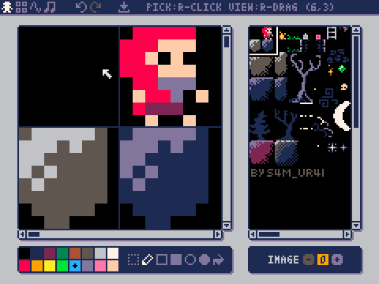

Per Drag and Drop lässt sich eine png Datei in der Image Bank öffnen.

**Tilemap-Editor:**

Der Modus zum editieren von Tilemaps in welcher Bilder aus der Image Bank in einem tile pattern arrangiert sind.

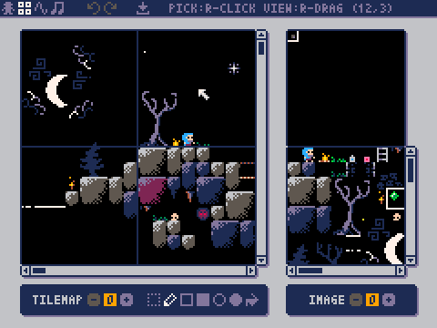

**Sound-Editor:**

Der Modus um Sounds zu editieren.

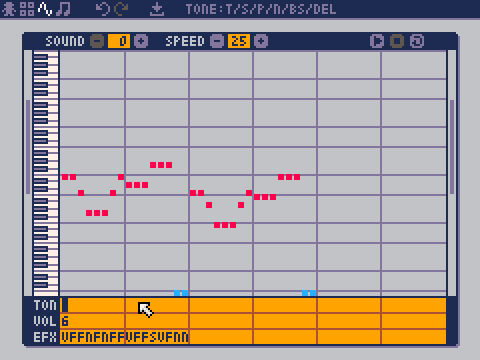

**Musik-Editor:**

Der Modus um Sounds in Wiedergabereihenfolge zu Musik zusammenzufügen.

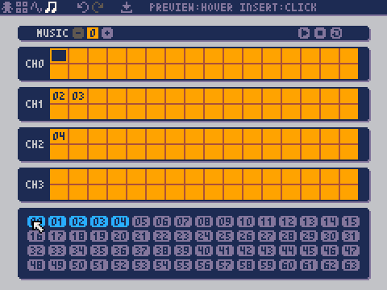

### Andere Methoden der Ressourcenerstellung

Pyxel-Bilder und Tilemaps können auch auf folgendem Weg erstellt werden:

- Erstelle eine Bild aus einer Liste von Strings mit der Funktion `Image.set` oder `Tilemap.set`
- Lade eine png-Datei in die Pyxel-Palette mit der Funktion `Image.load`

Pyxel Sounds lassen sich auf folgendermaßen erstellen:

- Erstelle Sounds aus Strings mit der `Sound.set` oder `Music.set` Funktion

Bitte lesen Sie die API-Referenz für die Verwendung dieser Funktionen.

### Eine Stand-Alone Executable erstellen

Mit dem Pyxel Packager können Executables erstellt werden, die ohne eine Python-Installation ausgeführt werden können.

Um eine Stand-alone Executable in einer Umgebung, in der der [PyInstaller](https://www.pyinstaller.org/) läuft, zu erstellen, gib die Python-Datei an, die beim Programmstart ausgeführt werden soll, mit dem `pyxelpackager` Befehl wie folgt an: 

```sh
pyxelpackager python_file
```

Anschließend hast du eine Stand-alone Executable in dem `dist` Ordner.

Wenn Ressourcen wie .pyxres- oder .png-Datein benötigt werden, kopiere sie in den `assets` Ordner.

Es ist auch möglich ein Icon mit dem Befehl ``-i icon_file`` anzugeben.

## API-Referenz

### System

- `width`, `height`<br>
Die Breite und Höhe des Fensters

- `frame_count`<br>
Die Anzahl der bereits gezeigten Bilder

- `init(width, height, [caption], [scale], [palette], [fps], [quit_key], [fullscreen])`<br>
Initialisiert die Pyxel-Anwendung mit der Fenstergröße (`width`, `height`). Die maximale Fensterbreite ist 256<br>
Außerdem kannst du den Titel mit `caption`, die Displaygröße mit `scale`, Die Palletenfarbe mit `palette`, Bildwiederholrate mit `fps`, die Taste zum Beenden mit `quit_key` und ob in den Fullscreen gestartet werden soll mit `fullscreen` ändern. `palette` ist eine Liste von 16 Elementen einer 24-Bit-Farbe.<br>
z.B. `pyxel.init(160, 120, caption="Pyxel with PICO-8 palette", palette=[0x000000, 0x1D2B53, 0x7E2553, 0x008751, 0xAB5236, 0x5F574F, 0xC2C3C7, 0xFFF1E8, 0xFF004D, 0xFFA300, 0xFFEC27, 0x00E436, 0x29ADFF, 0x83769C, 0xFF77A8, 0xFFCCAA], quit_key=pyxel.KEY_NONE, fullscreen=True)`

- `run(update, draw)`<br>
Startet die Pyxel-Anwendung und rufe die `update` Funktion für die Berechnungen zwischen den Bildern und der `draw` Funktion um ein neues Bild anzuzeigen

- `quit()`<br>
Beendet die Pyxel-Anwendung nach dem aktuellen Frame

- `flip()`<br>
Erzwingt ein neues Bild (nicht in normaler Anwendung nutzen)

- `show()`<br>
Ein Bild zeichnen und für immer warten (nicht in normaler Anwendung nutzen)

### Ressource

- `save(filename)`<br>
Speichern Sie die Ressourcendatei (.pyxres) in das Verzeichnis des auszuführenden Skripts

- `load(filename, [image], [tilemap], [sound], [music])`<br>
Lade die Ressourcendatei (.pyxres) aus dem Verzeichnis des auszuführenden Skripts. Falls ``False`` für den Ressourcentypen angegeben ist (image/tilemap/sound/music), wird die Ressource nicht geladen

### Eingabe
- `mouse_x`, `mouse_y`<br>
Die aktuelle Position der Maus

- `mouse_wheel`<br>
Der aktuelle Wert des Scrollrads

- `btn(key)`<br>
Return `True` falls `key` gedrückt ist, sonst return `False` ([key definition list](pyxel/__init__.py))

- `btnp(key, [hold], [period])`<br>
Return `True` falls `key` gedrückt ist, sonst return `False`. Wenn `hold` und `period` angegeben sind, wird `True` am `period` Bildintervall returned, falls `key` für mehr als `hold` Frames gedrückt ist

- `btnr(key)`<br>
Return `True` falls `key` in dem Frame losgelassen wird, sonst return `False`

- `mouse(visible)`<br>
Falls `visible`  `True` ist, zeige den Mauscursor. Falls `False`, verstecke ihn. Obwohl man den Cursor dann nicht sehen kann, wird seine Position geupdated

### Grafiken

- `image(img, [system])`<br>
Bediene die Image Bank `img`(0-2) (siehe die Image class). Falls `system` `True` ist, kannst du auf die Image Bank für das System zugreifen. 3 steht für die Schriftart und den Ressourceneditor. 4 steht für das Fenster<br>
e.g. `pyxel.image(0).load(0, 0, "title.png")`

- `tilemap(tm)`<br>
Bediene die Tilemap `tm`(0-7) (siehe die Tilemap class)

- `clip(x, y, w, h)`<br>
Setze den Bildausschnitt von (`x`, `y`) zu Breite `w` und Höhe `h`. Setze den Bildausschnitt zurück zum Follbild mit `clip()`

- `pal(col1, col2)`<br>
Ersetze Farbe `col1` mit `col2` beim zeichnen. Mit `pal()` lässt sich die Pallete auf die initiale zurücksetzen

- `cls(col)`<br>
Das Fenster mit der Farbe `col` füllen

- `pget(x, y)`<br>
Erhalte den Pixel an der Position (`x`, `y`).

- `pset(x, y, col)`<br>
Zeichne einen Pixel der Farbe `col` an der Position (`x`, `y`)

- `line(x1, y1, x2, y2, col)`<br>
Zeichne eine Linie der Farbe `col` von (`x1`, `y1`) bis (`x2`, `y2`)

- `rect(x, y, w, h, col)`<br>
Zeichne ein Rechteck der Breite `w`, Höhe `h` und Farbe `col` ausgehend von (`x`, `y`)

- `rectb(x, y, w, h, col)`<br>
Zeichne die Umrisse eines Rechtecks der Breite `w`, Höhe `h` und Farbe `col` ausgehend von (`x`, `y`)

- `circ(x, y, r, col)`<br>
Zeichne einen Kreis mit dem Radius `r` und Farbe `col` an der Stelle (`x`, `y`)

- `circb(x, y, r, col)`<br>
Zeichne die Umrisse eines Kreises mit dem Radius `r` und Farbe `col` an der Stelle (`x`, `y`)

- `tri(x1, y1, x2, y2, x3, y3, col)`<br>
Zeichne ein Dreieck mit den Scheitelpunkten (`x1`, `y1`), (`x2`, `y2`), (`x3`, `y3`) und Farbe `col`

- `trib(x1, y1, x2, y2, x3, y3, col)`<br>
Zeichne die Umrisse eines Dreiecks mit den Scheitelpunkten (`x1`, `y1`), (`x2`, `y2`), (`x3`, `y3`) und Farbe `col`

- `blt(x, y, img, u, v, w, h, [colkey])`<br>
Kopiere eine Region der Größe (`w`, `h`) von (`u`, `v`) des Image Banks `img`(0-2) zur Position (`x`, `y`). Falls `w` und/oder `h` negativ ist, wird der Ausschnitt horizontal und/oder vertical gespiegelt. Falls `colkey` angegeben ist, wird der Auschnitt als transparentes Farbe behandelt

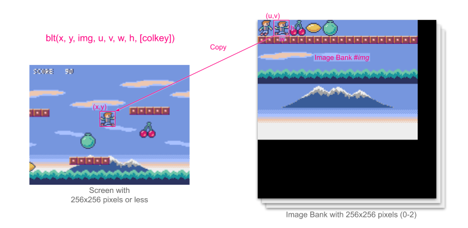

- `bltm(x, y, tm, u, v, w, h, [colkey])`<br>
Zeichne die Tilemap `tm`(0-7) zur Position (`x`, `y`) entsprechend der Tile-Information der Größe (`w`, `h`) ausgehend von (`u`, `v`). Falls `colkey` angegeben ist, wird der Auschnitt als transparentes Farbe behandelt. Ein Tile der Tilemap wird mit der Größe 8x8 gemalt und falls die Tile-Nummer 0 ist, bezeichnet es die Region (0, 0)-(7, 7) der Image Bank, falls 1, (8, 0)-(15, 0) sind angegeben

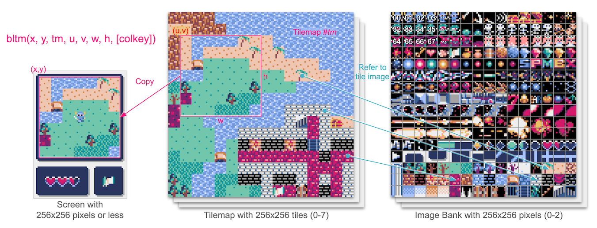

- `text(x, y, s, col)`<br>
Zeichne einen String `s` der Farbe `col` bei (`x`, `y`)

### Audio

- `sound(snd, [system])`<br>
Bediene den Ton `snd`(0-63) (siehe die Sound class). Falls `system` `True` ist, kann auf den Ton 64 für das System zugegriffen werden<br>
z.B. `pyxel.sound(0).speed = 60`

- `music(msc)`<br>
Bediene die Musik `msc`(0-7) (siehe die Music class)

- `play_pos(ch)`<br>
Erhalte die Sound-Playback-Position des Kanals `ch`. Die 100's und 1000's zeigen die Soundnummer und die 1's und 10's zeigen die Notennummer. Wenn playback gestoppt ist, return `-1`

- `play(ch, snd, loop=False)`<br>
Spiele den Ton `snd`(0-63) auf Kanal `ch`(0-3). Spiele in gegebener Reihenfolge, wenn `snd` eine Liste ist

- `playm(msc, loop=False)`<br>
Spiele die Muisk `msc`(0-7)

- `stop([ch])`<br>
Stoppe das Abspielen auf allen Kanälen. Falls `ch`(0-3) angegeben ist, stoppe den dazugehörigen Kanal

### Image Klasse

- `width`, `height`<br>
Die Breite und Höhe des Bildes

- `data`<br>
Die Daten des Bildes (256x256 zweidimensionale list)

- `get(x, y)`<br>
Erhalte die Daten des Bildes an der Position (`x`, `y`)

- `set(x, y, data)`<br>
Setze die Daten des Bildes bei (`x`, `y`) auf einen Wert oder eine list an Strings<br>
z.B. `pyxel.image(0).set(10, 10, ["1234", "5678", "9abc", "defg"])`

- `load(x, y, filename)`<br>
Lade das Bild aus dem Ausführungsverzeichnis bei (`x`, `y`)

- `copy(x, y, img, u, v, w, h)`<br>
Kopiere die Region der Größe (`w`, `h`) ausgehend von (`u`, `v`) von der Image Bank `img`(0-2) zu (`x`, `y`)

### Tilemap Klasse

- `width`, `height`<br>
Die Breite und Höhe der Tilemap

- `data`<br>
Die Datein der Tilemap (256x256 zweidimensionale list)

- `refimg`<br>
Die, von der Tilemap referenzierte Image Bank

- `get(x, y)`<br>
Erhalte die Daten der Tilemap bei (`x`, `y`)

- `set(x, y, data)`<br>
Setze die Daten der Tilemap bei (`x`, `y`) auf einen Wert oder eine list an Strings.<br>
z.B. `pyxel.tilemap(0).set(0, 0, ["000102", "202122", "a0a1a2", "b0b1b2"])`

- `copy(x, y, tm, u, v, w, h)`<br>
Kopiere die Region der Größe (`w`, `h`) von (`u`, `v`) der Tilemap `tm`(0-7) zu (`x`, `y`)

### Sound Klasse

- `note`<br>
Liste von Noten(0-127) (33 = 'A2' = 440Hz)

- `tone`<br>
Liste von Tönen(0:Triangle / 1:Square / 2:Pulse / 3:Noise)

- `volume`<br>
Liste der Lautstärke(0-7)

- `effect`<br>
Liste der Soundeffekte(0:None / 1:Slide / 2:Vibrato / 3:FadeOut)

- `speed`<br>
Die Länge einer Note(120 = 1 second per tone)

- `set(note, tone, volume, effect, speed)`<br>
Setze eine Note, Ton, Lautstärke und Effekt mit einem String. Fallse der Ton, die Lautstärke und Effektlänge kürzer sind als die Note, wird es vom Beginn an wiederholt

- `set_note(note)`<br>
Setze die Note mit einem String aus 'CDEFGAB'+'#-'+'0123' oder 'R'. Groß-Klein-Schreibung und Leerzeichen werden ignoriert<br>
z.B. `pyxel.sound(0).set_note("G2B-2D3R RF3F3F3")`

- `set_tone(tone)`<br>
Setze die Note mit einem String aus 'TSPN'. Groß-Klein-Schreibung und Leerzeichen werden ignoriert<br>
z.B. `pyxel.sound(0).set_tone("TTSS PPPN")`

- `set_volume(volume)`<br>
Setze die Lautstärke mit einem String aus '01234567'. Groß-Klein-Schreibung und Leerzeichen werden ignoriert<br>
z.B. `pyxel.sound(0).set_volume("7777 7531")`

- `set_effect(effect)`<br>
Setze den Effekt mit einem String aus 'NSVF'. Groß-Klein-Schreibung und Leerzeichen werden ignoriert<br>
z.B. `pyxel.sound(0).set_effect("NFNF NVVS")`

### Music Klasse

- `ch0`<br>
Liste der Töne (0-63), die auf Kanal 0 abgespielt werden. Wenn eine leere Liste angegeben wird, wird der Kanal nicht für die Wiedergabe verwendet.

- `ch1`<br>
Liste der Töne (0-63), die auf Kanal 1 abgespielt werden. Wenn eine leere Liste angegeben wird, wird der Kanal nicht für die Wiedergabe verwendet.

- `ch2`<br>
Liste der Töne (0-63), die auf Kanal 2 abgespielt werden. Wenn eine leere Liste angegeben wird, wird der Kanal nicht für die Wiedergabe verwendet.

- `ch3`<br>
Liste der Töne (0-63), die auf Kanal 3 abgespielt werden. Wenn eine leere Liste angegeben wird, wird der Kanal nicht für die Wiedergabe verwendet.

- `set(ch0, ch1, ch2, ch3)`<br>
Setzt die Liste der Töne (0-63) aller Kanäle. Wenn eine leere Liste angegeben wird, wird dieser Kanal nicht für die Wiedergabe verwendet<br>
z.B. `pyxel.music(0).set([0, 1], [2, 3], [4], [])`

- `set_ch0(data)`<br>
Setze die Liste der Töne(0-63) von Kanal 0

- `set_ch1(data)`<br>
Setze die Liste der Töne(0-63) von Kanal 1

- `set_ch2(data)`<br>
Setze die Liste der Töne(0-63) von Kanal 2

- `set_ch3(data)`<br>
Setze die Liste der Töne(0-63) von Kanal 2

## Wie du beitragen kannst

### Erstelle ein Issue

Nutze den [issue tracker] (https://github.com/kitao/pyxel/issues), um Fehlerberichte und Funktions-/Erweiterungswünsche einzureichen.
Bevor du ein neues Problem einreichst, durchsuche den Issue Tracker, um sicherzustellen, dass es kein ähnliches offenes Problem gibt.

Wenn Sie einen Bericht einreichen, wählen Sie die entsprechende Vorlage [von hier](https://github.com/kitao/pyxel/issues/new/choose).

### Manuelles Testen

Jeder, der den Code manuell testet und Fehler oder Verbesserungsvorschläge im Issue Tracker meldet, ist herzlich willkommen!

### Einreichen einer Pull-Anfrage

Patches/Fixes werden in Form von Pull Requests (PRs) akzeptiert. Stellen Sie sicher, dass das Problem, auf das sich der Pull Request bezieht, im Issue Tracker offen ist.

Bei einem eingereichten Pull-Request wird davon ausgegangen, dass der Veröffentlichung unter der [MIT Lizenz](LICENSE) zugestimmt wird.

## Other Information

- [Wiki](https://github.com/kitao/pyxel/wiki)
- [Subreddit](https://www.reddit.com/r/pyxel/)
- [Discord Server (English)](https://discord.gg/FC7kUZJ)
- [Discord Server (Japanisch - 日本語版)](https://discord.gg/qHA5BCS)

## License

Pyxel steht unter der [MIT Lizenz](http://en.wikipedia.org/wiki/MIT_License). Sie kann innerhalb proprietärer Software wiederverwendet werden, vorausgesetzt, dass alle Kopien der lizenzierten Software eine Kopie der MIT-Lizenzbedingungen und des Copyright-Vermerks enthalten.

Pyxel nutzt folgende Software:

- [SDL2](https://www.libsdl.org/)
- [miniz-cpp](https://github.com/tfussell/miniz-cpp)
- [Gifsicle](https://www.lcdf.org/gifsicle/)
