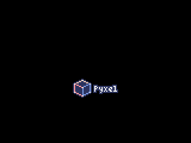
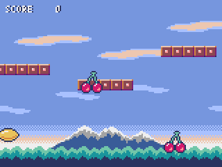
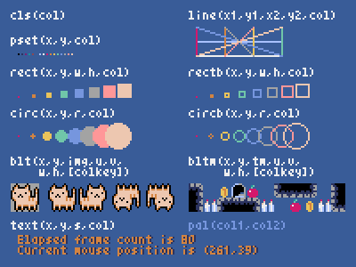
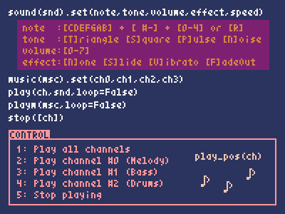
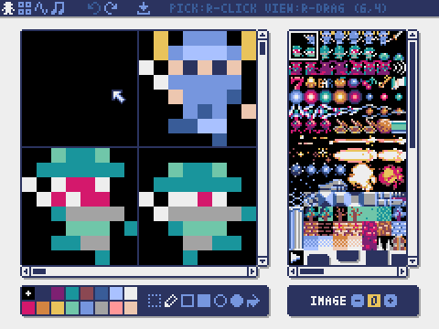
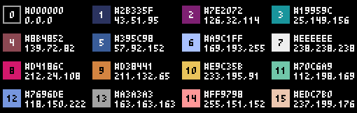
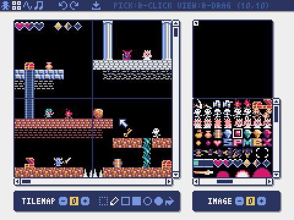
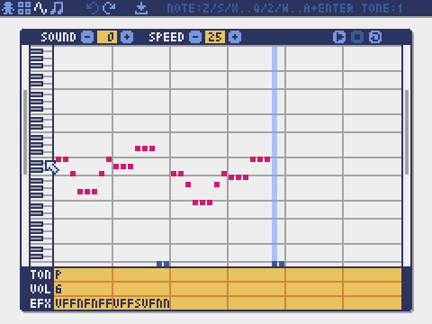
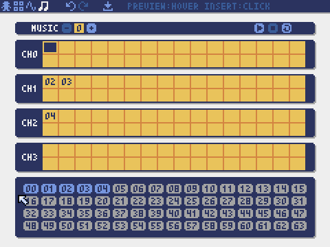
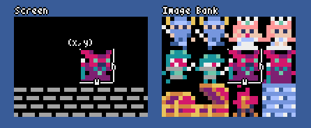

# 

[](https://pypi.org/project/pyxel/)
[](https://github.com/kitao/pyxel)
[](https://github.com/kitao/pyxel)
[](https://github.com/sponsors/kitao)

[](https://ko-fi.com/H2H27VDKD)

[ [English](README.md) | [中文](doc/README.cn.md) | [Deutsch](doc/README.de.md) | [Español](doc/README.es.md) | [Français](doc/README.fr.md) | [Italiano](doc/README.it.md) | [日本語](doc/README.ja.md) | [한국어](doc/README.ko.md) | [Português](doc/README.pt.md) | [Русский](doc/README.ru.md) ]

**Pyxel** is a retro game engine for Python.

Thanks to its simple specifications inspired by retro gaming consoles, such as only 16 colors can be displayed and only 4 sounds can be played back at the same time, you can feel free to enjoy making pixel art style games.








Pyxel's specifications and APIs are inspired by [PICO-8](https://www.lexaloffle.com/pico-8.php) and [TIC-80](https://tic80.com/).

Pyxel is open source and free to use. Let's start making a retro game with Pyxel!

## Specifications

- Run on Windows, Mac, and Linux
- Programming with Python
- 16 color palette
- 256x256 sized 3 image banks
- 256x256 sized 8 tilemaps
- 4 channels with 64 definable sounds
- 8 musics which can combine arbitrary sounds
- Keyboard, mouse, and gamepad inputs
- Image and sound editor

### Color Palette




## How to Install

There are two types of Pyxel, a packaged version and a standalone version.

### Install Packaged Version

The packaged version of Pyxel uses Pyxel as a Python extension module.

Recommended for those who are familiar with managing Python packages using the `pip` command or who want to develop full-fledged Python applications.

**Windows**

After installing [Python3](https://www.python.org/) (version 3.7 or higher), run the following command:

```sh
pip install -U pyxel
```

**Mac**

After installing [Python3](https://www.python.org/) (version 3.7 or higher), run the following command:

```sh
pip3 install -U pyxel
```

**Linux**

After installing the SDL2 package (`libsdl2-dev` for Ubuntu), [Python3](https://www.python.org/) (version 3.7 or higher), and `python3-pip`, run the following command:

```sh
sudo pip3 install -U pyxel
```

If the above doesn't work, try self-building by following the steps below after installing `cmake` and `rust`:

```sh
git clone https://github.com/kitao/pyxel.git
cd pyxel
make clean all
sudo pip3 install .
```

### Install Standalone Version

The standalone version of Pyxel uses Pyxel as a standalone tool that does not depend on Python.

Recommended for those who want to start programming easily without worrying about Python settings, or those who want to play Pyxel games immediately.

**Windows**

Download and run the latest version of the Windows installer (`pyxel-[version]-windows-setup.exe`) from the [Download Page](https://github.com/kitao/pyxel/releases).

**Mac**

After installing [Homebrew](https://brew.sh/), run the following commands:

```sh
brew tap kitao/pyxel
brew install pyxel
```

**Linux**

After installing the SDL2 package (`libsdl2-dev` for Ubuntu) and installing [Homebrew](https://brew.sh/), run the following commands:

```sh
brew tap kitao/pyxel
brew install pyxel
```

If the above doesn't work, try self-building the packaged version.

### Try Pyxel Examples

After installing Pyxel, the examples of Pyxel will be copied to the current directory with the following command:

```sh
pyxel copy_examples
```

The examples to be copied are as follows:

- [01_hello_pyxel.py](pyxel/examples/01_hello_pyxel.py) - Simplest application
- [02_jump_game.py](pyxel/examples/02_jump_game.py) - Jump game with Pyxel resource file
- [03_draw_api.py](pyxel/examples/03_draw_api.py) - Demonstration of drawing APIs
- [04_sound_api.py](pyxel/examples/04_sound_api.py) - Demonstration of sound APIs
- [05_color_palette.py](pyxel/examples/05_color_palette.py) - Color palette list
- [06_click_game.py](pyxel/examples/06_click_game.py) - Mouse click game
- [07_snake.py](pyxel/examples/07_snake.py) - Snake game with BGM
- [08_triangle_api.py](pyxel/examples/08_triangle_api.py) - Demonstration of triangle drawing APIs
- [09_shooter.py](pyxel/examples/09_shooter.py) - Shoot'em up game with screen transition
- [10_platformer.py](pyxel/examples/10_platformer.py) - Side-scrolling platform game with map
- [11_offscreen.py](pyxel/examples/11_offscreen.py) - Offscreen rendering with Image class
- [12_perlin_noise.py](pyxel/examples/12_perlin_noise.py) - Perlin noise animation
- [30SecondsOfDaylight.pyxapp](doc/images/30SecondsOfDaylight.gif) - 1st Pyxel Jam winning game by [Adam](https://twitter.com/helpcomputer0)
- [megaball.pyxapp](doc/images/megaball.gif) - Arcade ball physics game by [Adam](https://twitter.com/helpcomputer0)

An examples can be executed with the following commands:

```sh
cd pyxel_examples
pyxel run 01_hello_pyxel.py
pyxel play 30SecondsOfDaylight.pyxapp
```

## How to Use

### Create Pyxel Application

After importing the Pyxel module in your python script, specify the window size with `init` function first, then starts the Pyxel application with `run` function.

```python
import pyxel

pyxel.init(160, 120)

def update():
    if pyxel.btnp(pyxel.KEY_Q):
        pyxel.quit()

def draw():
    pyxel.cls(0)
    pyxel.rect(10, 10, 20, 20, 11)

pyxel.run(update, draw)
```

The arguments of `run` function are `update` function to update each frame and `draw` function to draw screen when necessary.

In an actual application, it is recommended to wrap pyxel code in a class as below:

```python
import pyxel

class App:
    def __init__(self):
        pyxel.init(160, 120)
        self.x = 0
        pyxel.run(self.update, self.draw)

    def update(self):
        self.x = (self.x + 1) % pyxel.width

    def draw(self):
        pyxel.cls(0)
        pyxel.rect(self.x, 0, 8, 8, 9)

App()
```

It is also possible to write simple code using `show` function and `flip` function to draw simple graphics and animations.

`show` function displays the screen and waits until the `Esc` key is pressed.

```python
import pyxel

pyxel.init(120, 120)
pyxel.cls(1)
pyxel.circb(60, 60, 40, 7)
pyxel.show()
```

`flip` function updates the screen once.

```python
import pyxel

pyxel.init(120, 80)

while True:
    pyxel.cls(3)
    pyxel.rectb(pyxel.frame_count % 160 - 40, 20, 40, 40, 7)
    pyxel.flip()
```

### Run Pyxel Application

The created Python script can be executed with the following command:

```sh
pyxel run PYTHON_SCRIPT_FILE
```

For the packaged version, it can be executed like a normal Python script:

```sh
cd pyxel_examples
python3 PYTHON_SCRIPT_FILE
```

(For Windows, type `python` instead of `python3`)

### Special Controls

The following special controls can be performed while a Pyxel application is running:

- `Esc`<br>
Quit the application
- `Alt(Option)+1`<br>
Save the screenshot to the desktop
- `Alt(Option)+2`<br>
Reset the recording start time of the screen capture video
- `Alt(Option)+3`<br>
Save the screen capture video to the desktop (up to 10 seconds)
- `Alt(Option)+0`<br>
Toggle the performance monitor (fps, update time, and draw time)
- `Alt(Option)+Enter`<br>
Toggle full screen

### How to Create Resource

Pyxel Editor can create images and sounds used in a Pyxel application.

It starts with the following command:

```sh
pyxel edit [PYXEL_RESOURCE_FILE]
```

If the specified Pyxel resource file (.pyxres) exists, the file is loaded, and if it does not exist, a new file is created with the specified name.
If the resource file is omitted, the name is `my_resource.pyxres`.

After starting Pyxel Editor, the file can be switched by dragging and dropping another resource file. If the resource file is dragged and dropped while holding down ``Ctrl(Cmd)`` key, only the resource type (Image/Tilemap/Sound/Music) that is currently being edited will be loaded. This operation enables to combine multiple resource files into one.

The created resource file can be loaded with `load` function.

Pyxel Editor has the following edit modes.

**Image Editor:**

The mode to edit the image banks.


By dragging and dropping an image file (png/gif/jpeg) onto the Image Editor screen, the image can be loaded into the currently selected image bank.

**Tilemap Editor:**

The mode to edit tilemaps in which images of the image banks are arranged in a tile pattern.



**Sound Editor:**

The mode to edit sounds.



**Music Editor:**

The mode to edit musics in which the sounds are arranged in order of playback.



### Other Resource Creation Methods

Pyxel images and tilemaps can also be created by the following methods:

- Create an image from a list of strings with `Image.set` function or `Tilemap.set` function
- Load an image file (png/gif/jpeg) in Pyxel palette with `Image.load` function

Pyxel sounds can also be created in the following method:

- Create a sound from strings with `Sound.set` function or `Music.set` function

Please refer to the API reference for usage of these functions.

### How to Distribute Application

Pyxel supports a dedicated application distribution file format (Pyxel application file) that works across platforms.

Create the Pyxel application file (.pyxapp) with the following command:

```sh
pyxel package APP_ROOT_DIR STARTUP_SCRIPT_FILE
```

If the application should include resources or additional modules, place them in the application folder.

The created application file can be executed with the following command:

```sh
pyxel play PYXEL_APP_FILE
```

## API Reference

### System

- `width`, `height`<br>
The width and height of the screen

- `frame_count`<br>
The number of the elapsed frames

- `init(width, height, [title], [fps], [quit_key], [capture_scale], [capture_sec])`<br>
Initialize the Pyxel application with screen size (`width`, `height`). The following can be specified as options: the window title with `title`, the frame rate with `fps`, the key to quit the application with `quit_key`, the scale of the screen capture with `capture_scale`, and the maximum recording time of the screen capture video with `capture_sec`.<br>
e.g. `pyxel.init(160, 120, title="My Pyxel App", fps=60, quit_key=pyxel.KEY_NONE, capture_scale=3, capture_sec=0)`

- `run(update, draw)`<br>
Start the Pyxel application and call `update` function for frame update and `draw` function for drawing.

- `show()`<br>
Show the screen and wait until the `Esc` key is pressed. (Do not use in normal applications)

- `flip()`<br>
Updates the screen once. (Do not use in normal applications)

- `quit()`<br>
Quit the Pyxel application.

### Resource

- `load(filename, [image], [tilemap], [sound], [music])`<br>
Load the resource file (.pyxres). If ``False`` is specified for the resource type (``image/tilemap/sound/music``), the resource will not be loaded.

### Input
- `mouse_x`, `mouse_y`<br>
The current position of the mouse cursor

- `mouse_wheel`<br>
The current value of the mouse wheel

- `btn(key)`<br>
Return `True` if `key` is pressed, otherwise return `False`. ([Key definition list](pyxel/__init__.pyi))

- `btnp(key, [hold], [repeat])`<br>
Return `True` if `key` is pressed at that frame, otherwise return `False`. When `hold` and `repeat` are specified, `True` will be returned at the `repeat` frame interval when the `key` is held down for more than `hold` frames.

- `btnr(key)`<br>
Return `True` if `key` is released at that frame, otherwise return `False`.

- `mouse(visible)`<br>
If `visible` is `True`, show the mouse cursor. If `False`, hide it. Even if the mouse cursor is not displayed, its position is updated.

### Graphics

- `colors`<br>
List of the palette display colors. The display color is specified by a 24-bit numerical value. Use `colors.from_list` and `colors.to_list` to directly assign and retrieve Python lists.<br>
e.g. `org_colors = pyxel.colors.to_list(); pyxel.colors[15] = 0x112233; pyxel.colors.from_list(org_colors)`

- `image(img)`<br>
Operate the image bank `img` (0-2). (See the Image class)<br>
e.g. `pyxel.image(0).load(0, 0, "title.png")`

- `tilemap(tm)`<br>
Operate the tilemap `tm` (0-7). (See the Tilemap class)

- `clip(x, y, w, h)`<br>
Set the drawing area of the screen from (`x`, `y`) to width `w` and height `h`. Reset the drawing area to full screen with `clip()`.

- `camera(x, y)`<br>
Change the upper left corner coordinates of the screen to (`x`, `y`). Reset the upper left corner coordinates to (`0`, `0`) with `camera()`.

- `pal(col1, col2)`<br>
Replace color `col1` with `col2` at drawing. `pal()` to reset to the initial palette.

- `cls(col)`<br>
Clear screen with color `col`.

- `pget(x, y)`<br>
Get the color of the pixel at (`x`, `y`).

- `pset(x, y, col)`<br>
Draw a pixel of color `col` at (`x`, `y`).

- `line(x1, y1, x2, y2, col)`<br>
Draw a line of color `col` from (`x1`, `y1`) to (`x2`, `y2`).

- `rect(x, y, w, h, col)`<br>
Draw a rectangle of width `w`, height `h` and color `col` from (`x`, `y`).

- `rectb(x, y, w, h, col)`<br>
Draw the outline of a rectangle of width `w`, height `h` and color `col` from (`x`, `y`).

- `circ(x, y, r, col)`<br>
Draw a circle of radius `r` and color `col` at (`x`, `y`).

- `circb(x, y, r, col)`<br>
Draw the outline of a circle of radius `r` and color `col` at (`x`, `y`).

- `elli(x, y, w, h, col)`<br>
Draw an ellipse of width `w`, height `h` and color `col` from (`x`, `y`).

- `ellib(x, y, w, h, col)`<br>
Draw the outline of an ellipse of width `w`, height `h` and color `col` from (`x`, `y`).

- `tri(x1, y1, x2, y2, x3, y3, col)`<br>
Draw a triangle with vertices (`x1`, `y1`), (`x2`, `y2`), (`x3`, `y3`) and color `col`.

- `trib(x1, y1, x2, y2, x3, y3, col)`<br>
Draw the outline of a triangle with vertices (`x1`, `y1`), (`x2`, `y2`), (`x3`, `y3`) and color `col`.

- `fill(x, y, col)`<br>
Fill the area connected with the same color as (`x`, `y`) with color `col`.

- `blt(x, y, img, u, v, w, h, [colkey])`<br>
Copy the region of size (`w`, `h`) from (`u`, `v`) of the image bank `img` (0-2) to (`x`, `y`). If negative value is set for `w` and/or `h`, it will reverse horizontally and/or vertically. If `colkey` is specified, treated as transparent color.



- `bltm(x, y, tm, u, v, w, h, [colkey])`<br>
Copy the region of size (`w`, `h`) from (`u`, `v`) of the tilemap `tm` (0-7) to (`x`, `y`). If negative value is set for `w` and/or `h`, it will reverse horizontally and/or vertically. If `colkey` is specified, treated as transparent color. The size of a tile is 8x8 pixels and is stored in a tilemap as a tuple of `(tile_x, tile_y)`.


- `text(x, y, s, col)`<br>
Draw a string `s` of color `col` at (`x`, `y`).

### Audio

- `sound(snd)`<br>
Operate the sound `snd` (0-63). (See the Sound class)<br>
e.g. `pyxel.sound(0).speed = 60`

- `music(msc)`<br>
Operate the music `msc` (0-7). (See the Music class)

- `play_pos(ch)`<br>
Get the sound playback position of channel `ch` (0-3) as a tuple of `(sound no, note no)`. Returns `None` when playback is stopped.

- `play(ch, snd, [tick], [loop])`<br>
Play the sound `snd` (0-63) on channel `ch` (0-3). If `snd` is a list, it will be played in order. The playback start position can be specified by `tick` (1 tick = 1/120 seconds). If `True` is specified for `loop`, loop playback is performed.

- `playm(msc, [tick], [loop])`<br>
Play the music `msc` (0-7). The playback start position can be specified by `tick` (1 tick = 1/120 seconds). If `True` is specified for `loop`, loop playback is performed.

- `stop([ch])`<br>
Stops playback of the specified channel `ch` (0-3). `stop()` to stop playing all channels.

### Math

- `ceil(x)`<br>
Returns the smallest integer greater than or equal to `x`.

- `floor(x)`<br>
Returns the largest integer less than or equal to `x`.

- `sgn(x)`<br>
Returns 1 when `x` is positive, 0 when it is zero, and -1 when it is negative.

- `sqrt(x)`<br>
Returns the square root of `x`.

- `sin(deg)`<br>
Returns the sine of `deg` degrees.

- `cos(deg)`<br>
Returns the cosine of `deg` degrees.

- `atan2(y, x)`<br>
Returns the arctangent of `y`/`x` in degrees.

- `rseed(seed: int)`<br>
Sets the seed of the random number generator.

- `rndi(a, b)`<br>
Returns an random integer greater than or equal to `a` and less than or equal to `b`.

- `rndf(a, b)`<br>
Returns a random decimal greater than or equal to `a` and less than or equal to `b`.

- `nseed(seed)`<br>
Sets the seed of Perlin noise.

- `noise(x, [y], [z])`<br>
Returns the Perlin noise value for the specified coordinates.

### Image Class

- `width`, `height`<br>
The width and height of the image

- `set(x, y, data)`<br>
Set the image at (`x`, `y`) by a list of strings.<br>
e.g. `pyxel.image(0).set(10, 10, ["0123", "4567", "89ab", "cdef"])`

- `load(x, y, filename)`<br>
Load the image file (png/gif/jpeg) at (`x`, `y`).

- `pget(x, y)`<br>
Get the pixel color at (`x`, `y`).

- `pset(x, y, col)`<br>
Draw a pixel of color `col` at (`x`, `y`).

### Tilemap Class

- `width`, `height`<br>
The width and height of the tilemap

- `refimg`<br>
The image bank (0-2) referenced by the tilemap

- `set(x, y, data)`<br>
Set the tilemap at (`x`, `y`) by a list of strings.<br>
e.g. `pyxel.tilemap(0).set(0, 0, ["0000 0100 a0b0", "0001 0101 a1b1"])`

- `pget(x, y)`<br>
Get the tile at (`x`, `y`). A tile is a tuple of `(tile_x, tile_y)`.

- `pset(x, y, tile)`<br>
Draw a `tile` at (`x`, `y`). A tile is a tuple of `(tile_x, tile_y)`.

### Sound Class

- `notes`<br>
List of notes (0-127). The higher the number, the higher the pitch, and at 33 it becomes 'A2'(440Hz). The rest is -1.

- `tones`<br>
List of tones (0:Triangle / 1:Square / 2:Pulse / 3:Noise)

- `volumes`<br>
List of volumes (0-7)

- `effects`<br>
List of effects (0:None / 1:Slide / 2:Vibrato / 3:FadeOut)

- `speed`<br>
Playback speed. 1 is the fastest, and the larger the number, the slower the playback speed. At 120, the length of one note becomes 1 second.

- `set(notes, tones, volumes, effects, speed)`<br>
Set notes, tones, volumes, and effects with a string. If the tones, volumes, and effects length are shorter than the notes, it is repeated from the beginning.

- `set_notes(notes)`<br>
Set the notes with a string made of 'CDEFGAB'+'#-'+'0123' or 'R'. Case-insensitive and whitespace is ignored.<br>
e.g. `pyxel.sound(0).set_note("G2B-2D3R RF3F3F3")`

- `set_tones(tones)`<br>
Set the tones with a string made of 'TSPN'. Case-insensitive and whitespace is ignored.<br>
e.g. `pyxel.sound(0).set_tone("TTSS PPPN")`

- `set_volumes(volumes)`<br>
Set the volumes with a string made of '01234567'. Case-insensitive and whitespace is ignored.<br>
e.g. `pyxel.sound(0).set_volume("7777 7531")`

- `set_effects(effects)`<br>
Set the effects with a string made of 'NSVF'. Case-insensitive and whitespace is ignored.<br>
e.g. `pyxel.sound(0).set_effect("NFNF NVVS")`

### Music Class

- `snds_list`<br>
Two-dimensional list of sounds (0-63) with the number of channels

- `set(snds0, snds1, snds2, snds3)`<br>
Set the lists of sound (0-63) of all channels. If an empty list is specified, that channel is not used for playback.<br>
e.g. `pyxel.music(0).set([0, 1], [2, 3], [4], [])`

### Advanced APIs

Pyxel has "advanced APIs" that are not mentioned in this reference because they "may confuse users" or "need specialized knowledge to use".

If you are familiar with your skills, try to create amazing works with [this](pyxel/__init__.pyi) as a clue!

## How to Contribute

### Submitting Issue

Use the [Issue Tracker](https://github.com/kitao/pyxel/issues) to submit bug reports and feature/enhancement requests. Before submitting a new issue, ensure that there is no similar open issue.

### Manual Testing

Anyone manually testing the code and reporting bugs or suggestions for enhancements in the [Issue Tracker](https://github.com/kitao/pyxel/issues) are very welcome!

### Submitting Pull Request

Patches/fixes are accepted in form of pull requests (PRs). Make sure the issue the pull request addresses is open in the Issue Tracker.

Submitted pull request is deemed to have agreed to publish under [MIT License](LICENSE).

## Other Information

- [Q&A](https://github.com/kitao/pyxel/wiki/Pyxel-Q&A)
- [User Examples](https://github.com/kitao/pyxel/wiki/Pyxel-User-Examples)
- [Discord Server (English)](https://discord.gg/Z87eYHN)
- [Discord Server (Japanese - 日本語版)](https://discord.gg/qHA5BCS)

## License

Pyxel is under [MIT License](LICENSE). It can be reused within proprietary software, provided that all copies of the software or its substantial portions include a copy of the terms of the MIT License and also a copyright notice.

## Recruiting Sponsors

Pyxel is looking for sponsors on GitHub Sponsors. Consider sponsoring Pyxel for continued maintenance and feature additions. Sponsors can consult about Pyxel as a benefit. Please see [here](https://github.com/sponsors/kitao) for details.
