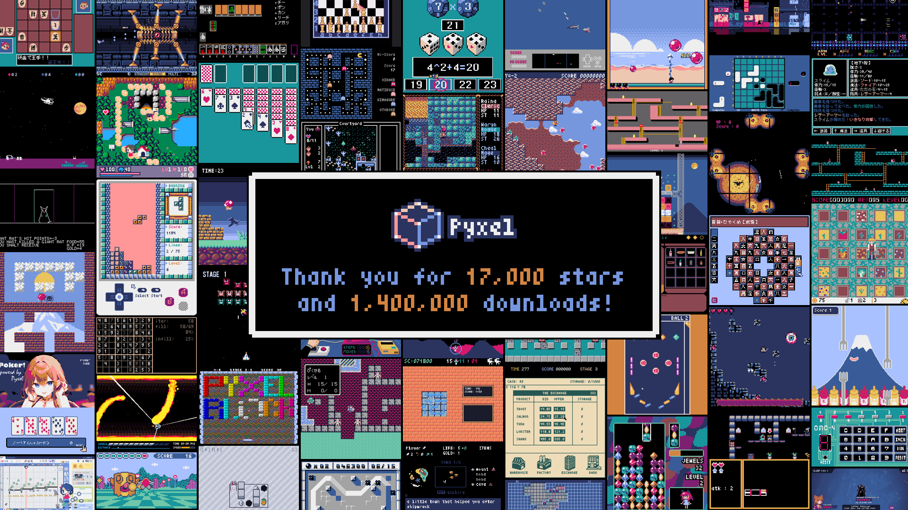
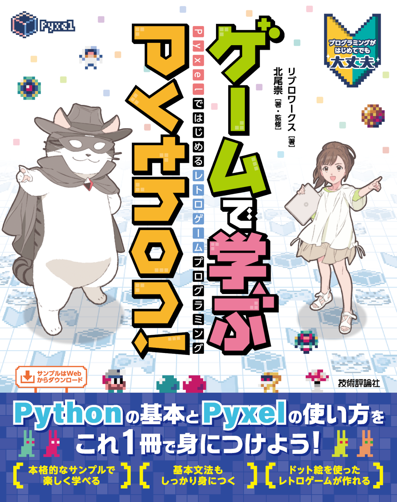
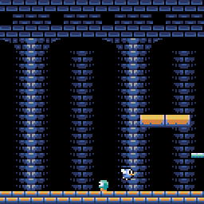
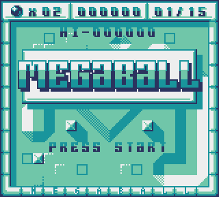

# 

[](https://pypi.org/project/pyxel/)
[](https://github.com/kitao/pyxel)
[](https://github.com/kitao/pyxel)
[](https://github.com/sponsors/kitao)

[](https://ko-fi.com/H2H27VDKD)

[ [English](README.md) | [中文](docs/README.cn.md) | [Deutsch](docs/README.de.md) | [Español](docs/README.es.md) | [Français](docs/README.fr.md) | [Italiano](docs/README.it.md) | [日本語](docs/README.ja.md) | [한국어](docs/README.ko.md) | [Português](docs/README.pt.md) | [Русский](docs/README.ru.md) | [Türkçe](docs/README.tr.md) | [Українська](docs/README.uk.md) ]

**Pyxel** (/ˈpɪksəl/) is a retro game engine for Python.

With simple specifications inspired by retro gaming consoles, such as displaying only 16 colors and supporting 4 sound channels, you can easily enjoy making pixel-art-style games.

[](https://github.com/kitao/pyxel/wiki/Pyxel-User-Examples) [](https://gihyo.jp/book/2025/978-4-297-14657-3)

The development of Pyxel is driven by user feedback. Please give Pyxel a star on GitHub!

<p>
<a href="https://kitao.github.io/pyxel/wasm/examples/10_platformer.html">

</a>
<a href="https://kitao.github.io/pyxel/wasm/examples/30sec_of_daylight.html">

</a>
<a href="https://kitao.github.io/pyxel/wasm/examples/02_jump_game.html">

</a>
<a href="https://kitao.github.io/pyxel/wasm/examples/megaball.html">

</a>
<a href="https://kitao.github.io/pyxel/wasm/examples/image_editor.html">

</a>
<a href="https://kitao.github.io/pyxel/wasm/examples/sound_editor.html">

</a>
</p>

Pyxel's specifications and APIs are inspired by [PICO-8](https://www.lexaloffle.com/pico-8.php) and [TIC-80](https://tic80.com/).

Pyxel is open source under the [MIT License](LICENSE) and free to use. Let's start making retro games with Pyxel!

## Specifications

- Runs on Windows, Mac, Linux, and Web
- Programming in Python
- Customizable screen size
- 16-color palette
- 3 256x256-sized image banks
- 8 256x256-sized tilemaps
- 4 channels with 64 definable sounds
- 8 music tracks combining any sounds
- Keyboard, mouse, and gamepad inputs
- Image and sound editing tools
- User-extensible colors, channels, and banks

### Color Palette


## How to Install

### Windows

After installing [Python3](https://www.python.org/) (version 3.8 or higher), run the following command:

```sh
pip install -U pyxel
```

When installing Python using the official installer, make sure to check the `Add Python 3.x to PATH` option to enable the `pyxel` command.

### Mac

After installing [Homebrew](https://brew.sh/), run the following commands:

```sh
brew install pipx
pipx ensurepath
pipx install pyxel
```

To upgrade Pyxel after installation, run `pipx upgrade pyxel`.

### Linux

After installing the SDL2 package (`libsdl2-dev` for Ubuntu), [Python3](https://www.python.org/) (version 3.8 or higher), and `python3-pip`, run the following command:

```sh
sudo pip3 install -U pyxel
```

If the previous command fails, consider building Pyxel from source by following the instructions in the [Makefile](Makefile).

### Web

The web version of Pyxel does not require Python or Pyxel installation and runs on PCs, smartphones, and tablets with supported web browsers.

For detailed instructions, please refer to [this page](docs/pyxel-web-en.md).

### Try Examples

After installing Pyxel, you can copy the examples to the current directory with the following command:

```sh
pyxel copy_examples
```

The following examples will be copied to your current directory:

<table>
<tr>
<td>01_hello_pyxel.py</td>
<td>Simplest application</td>
<td><a href="https://kitao.github.io/pyxel/wasm/examples/01_hello_pyxel.html">Demo</a></td>
<td><a href="https://github.com/kitao/pyxel/blob/main/python/pyxel/examples/01_hello_pyxel.py">Code</a></td>
</tr>
<tr>
<td>02_jump_game.py</td>
<td>Jump game with Pyxel resource file</td>
<td><a href="https://kitao.github.io/pyxel/wasm/examples/02_jump_game.html">Demo</a></td>
<td><a href="https://github.com/kitao/pyxel/blob/main/python/pyxel/examples/02_jump_game.py">Code</a></td>
</tr>
<tr>
<td>03_draw_api.py</td>
<td>Demonstration of drawing APIs</td>
<td><a href="https://kitao.github.io/pyxel/wasm/examples/03_draw_api.html">Demo</a></td>
<td><a href="https://github.com/kitao/pyxel/blob/main/python/pyxel/examples/03_draw_api.py">Code</a></td>
</tr>
<tr>
<td>04_sound_api.py</td>
<td>Demonstration of sound APIs</td>
<td><a href="https://kitao.github.io/pyxel/wasm/examples/04_sound_api.html">Demo</a></td>
<td><a href="https://github.com/kitao/pyxel/blob/main/python/pyxel/examples/04_sound_api.py">Code</a></td>
</tr>
<tr>
<td>05_color_palette.py</td>
<td>Color palette list</td>
<td><a href="https://kitao.github.io/pyxel/wasm/examples/05_color_palette.html">Demo</a></td>
<td><a href="https://github.com/kitao/pyxel/blob/main/python/pyxel/examples/05_color_palette.py">Code</a></td>
</tr>
<tr>
<td>06_click_game.py</td>
<td>Mouse click game</td>
<td><a href="https://kitao.github.io/pyxel/wasm/examples/06_click_game.html">Demo</a></td>
<td><a href="https://github.com/kitao/pyxel/blob/main/python/pyxel/examples/06_click_game.py">Code</a></td>
</tr>
<tr>
<td>07_snake.py</td>
<td>Snake game with BGM</td>
<td><a href="https://kitao.github.io/pyxel/wasm/examples/07_snake.html">Demo</a></td>
<td><a href="https://github.com/kitao/pyxel/blob/main/python/pyxel/examples/07_snake.py">Code</a></td>
</tr>
<tr>
<td>08_triangle_api.py</td>
<td>Demonstration of triangle drawing APIs</td>
<td><a href="https://kitao.github.io/pyxel/wasm/examples/08_triangle_api.html">Demo</a></td>
<td><a href="https://github.com/kitao/pyxel/blob/main/python/pyxel/examples/08_triangle_api.py">Code</a></td>
</tr>
<tr>
<td>09_shooter.py</td>
<td>Shoot'em up game with screen transitions and MML</td>
<td><a href="https://kitao.github.io/pyxel/wasm/examples/09_shooter.html">Demo</a></td>
<td><a href="https://github.com/kitao/pyxel/blob/main/python/pyxel/examples/09_shooter.py">Code</a></td>
</tr>
<tr>
<td>10_platformer.py</td>
<td>Side-scrolling platform game with map</td>
<td><a href="https://kitao.github.io/pyxel/wasm/examples/10_platformer.html">Demo</a></td>
<td><a href="https://github.com/kitao/pyxel/blob/main/python/pyxel/examples/10_platformer.py">Code</a></td>
</tr>
<tr>
<td>11_offscreen.py</td>
<td>Offscreen rendering with Image class</td>
<td><a href="https://kitao.github.io/pyxel/wasm/examples/11_offscreen.html">Demo</a></td>
<td><a href="https://github.com/kitao/pyxel/blob/main/python/pyxel/examples/11_offscreen.py">Code</a></td>
</tr>
<tr>
<td>12_perlin_noise.py</td>
<td>Perlin noise animation</td>
<td><a href="https://kitao.github.io/pyxel/wasm/examples/12_perlin_noise.html">Demo</a></td>
<td><a href="https://github.com/kitao/pyxel/blob/main/python/pyxel/examples/12_perlin_noise.py">Code</a></td>
</tr>
<tr>
<td>13_bitmap_font.py</td>
<td>Drawing a bitmap font</td>
<td><a href="https://kitao.github.io/pyxel/wasm/examples/13_bitmap_font.html">Demo</a></td>
<td><a href="https://github.com/kitao/pyxel/blob/main/python/pyxel/examples/13_bitmap_font.py">Code</a></td>
</tr>
<tr>
<td>14_synthesizer.py</td>
<td>Synthesizer using audio expansion features</td>
<td><a href="https://kitao.github.io/pyxel/wasm/examples/14_synthesizer.html">Demo</a></td>
<td><a href="https://github.com/kitao/pyxel/blob/main/python/pyxel/examples/14_synthesizer.py">Code</a></td>
</tr>
<tr>
<td>15_tiled_map_file.py</td>
<td>Loading and drawing a Tile Map File (.tmx)</td>
<td><a href="https://kitao.github.io/pyxel/wasm/examples/15_tiled_map_file.html">Demo</a></td>
<td><a href="https://github.com/kitao/pyxel/blob/main/python/pyxel/examples/15_tiled_map_file.py">Code</a></td>
</tr>
<tr>
<td>16_transform.py</td>
<td>Image rotation and scaling</td>
<td><a href="https://kitao.github.io/pyxel/wasm/examples/16_transform.html">Demo</a></td>
<td><a href="https://github.com/kitao/pyxel/blob/main/python/pyxel/examples/16_transform.py">Code</a></td>
</tr>
<tr>
<td>99_flip_animation.py</td>
<td>Animation with flip function (non-web platforms only)</td>
<td><a href="https://github.com/kitao/pyxel/blob/main/docs/images/99_flip_animation.gif">Demo</a></td>
<td><a href="https://github.com/kitao/pyxel/blob/main/python/pyxel/examples/99_flip_animation.py">Code</a></td>
</tr>
<tr>
<td>30sec_of_daylight.pyxapp</td>
<td>1st Pyxel Jam winning game by <a href="https://x.com/helpcomputer0">Adam</a></td>
<td><a href="https://kitao.github.io/pyxel/wasm/examples/30sec_of_daylight.html">Demo</a></td>
<td><a href="https://github.com/kitao/30SecondsOfDaylight">Code</a></td>
</tr>
<tr>
<td>megaball.pyxapp</td>
<td>Arcade ball physics game by <a href="https://x.com/helpcomputer0">Adam</a></td>
<td><a href="https://kitao.github.io/pyxel/wasm/examples/megaball.html">Demo</a></td>
<td><a href="https://github.com/kitao/megaball">Code</a></td>
</tr>
<tr>
<td>8bit-bgm-gen.pyxapp</td>
<td>Background music generator by <a href="https://x.com/frenchbread1222">frenchbread</a></td>
<td><a href="https://kitao.github.io/pyxel/wasm/examples/8bit-bgm-gen.html">Demo</a></td>
<td><a href="https://github.com/shiromofufactory/8bit-bgm-generator">Code</a></td>
</tr>
</table>

The examples can be executed with the following commands:

```sh
cd pyxel_examples
pyxel run 01_hello_pyxel.py
pyxel play 30sec_of_daylight.pyxapp
```

## How to Use

### Create Application

In your Python script, import the Pyxel module, specify the window size with the `init` function, and then start the Pyxel application with the `run` function.

```python
import pyxel

pyxel.init(160, 120)

def update():
    if pyxel.btnp(pyxel.KEY_Q):
        pyxel.quit()

def draw():
    pyxel.cls(0)
    pyxel.rect(10, 10, 20, 20, 11)

pyxel.run(update, draw)
```

The arguments of the `run` function are the `update` function, which processes frame updates, and the `draw` function, which handles screen drawing.

In an actual application, it is recommended to wrap Pyxel code in a class, as shown below:

```python
import pyxel

class App:
    def __init__(self):
        pyxel.init(160, 120)
        self.x = 0
        pyxel.run(self.update, self.draw)

    def update(self):
        self.x = (self.x + 1) % pyxel.width

    def draw(self):
        pyxel.cls(0)
        pyxel.rect(self.x, 0, 8, 8, 9)

App()
```

For creating simple graphics without animation, you can use the `show` function to simplify your code.

```python
import pyxel

pyxel.init(120, 120)
pyxel.cls(1)
pyxel.circb(60, 60, 40, 7)
pyxel.show()
```

### Run Application

A created script can be executed using the `python` command:

```sh
python PYTHON_SCRIPT_FILE
```

It can also be run with the `pyxel run` command:

```sh
pyxel run PYTHON_SCRIPT_FILE
```

Additionally, the `pyxel watch` command monitors changes in a specified directory and automatically re-runs the program when changes are detected:

```sh
pyxel watch WATCH_DIR PYTHON_SCRIPT_FILE
```

Directory monitoring can be stopped by pressing `Ctrl(Command)+C`.

### Special Key Controls

The following special key actions are available while a Pyxel application is running:

- `Esc`<br>
  Quit the application
- `Alt(Option)+1`<br>
  Save the screenshot to the desktop
- `Alt(Option)+2`<br>
  Reset the recording start time of the screen capture video
- `Alt(Option)+3`<br>
  Save a screen capture video to the desktop (up to 10 seconds)
- `Alt(Option)+8` or `A+B+X+Y+DL` on gamepad<br>
  Toggles screen scaling between maximum and integer
- `Alt(Option)+9` or `A+B+X+Y+DR` on gamepad<br>
  Switch between screen modes (Crisp/Smooth/Retro)
- `Alt(Option)+0` or `A+B+X+Y+DU` on gamepad<br>
  Toggle the performance monitor (fps/`update` time/`draw` time)
- `Alt(Option)+Enter` or `A+B+X+Y+DD` on gamepad<br>
  Toggle fullscreen
- `Shift+Alt(Option)+1/2/3`<br>
  Save image bank 0, 1, or 2 to the desktop
- `Shift+Alt(Option)+0`<br>
  Save the current color palette to the desktop

### How to Create Resources

Pyxel Editor can create images and sounds used in a Pyxel application.

You can start Pyxel Editor with the following command:

```sh
pyxel edit PYXEL_RESOURCE_FILE
```

If the specified Pyxel resource file (.pyxres) exists, it will be loaded. If it does not exist, a new file with the specified name will be created. If the resource file is omitted, a new file named `my_resource.pyxres` will be created.

After starting Pyxel Editor, you can switch to another resource file by dragging and dropping it onto Pyxel Editor.

The created resource file can be loaded using the `load` function.

Pyxel Editor has the following editing modes.

**Image Editor**

The mode for editing the image in each **image bank**.

<a href="https://kitao.github.io/pyxel/wasm/examples/image_editor.html">

</a>

You can drag and drop an image file (PNG/GIF/JPEG) into the image editor to load the image into the currently selected image bank.

**Tilemap Editor**

The mode for editing **tilemaps** that arrange images from the image banks in a tile pattern.

<a href="https://kitao.github.io/pyxel/wasm/examples/tilemap_editor.html">

</a>

Drag and drop a TMX file (Tiled Map File) onto the tilemap editor to load its layer 0 into the currently selected tilemap.

**Sound Editor**

The mode for editing **sounds** used for melodies and sound effects.

<a href="https://kitao.github.io/pyxel/wasm/examples/sound_editor.html">

</a>

**Music Editor**

The mode for editing **musics** in which the sounds are arranged in order of playback.

<a href="https://kitao.github.io/pyxel/wasm/examples/music_editor.html">

</a>

### Other Resource Creation Methods

Pyxel images and tilemaps can also be created using the following methods:

- Create an image from a list of strings using the `Image.set` function or the `Tilemap.set` function
- Load an image file (PNG/GIF/JPEG) in Pyxel palette with `Image.load` function

Pyxel sounds can also be created using the following method:

- Create a sound from strings with `Sound.set` function or `Music.set` function

Refer to the API reference for the usage of these functions.

### How to Distribute Applications

Pyxel supports a dedicated application distribution file format (Pyxel application file) that is cross-platform.

A Pyxel application file (.pyxapp) is created using the `pyxel package` command:

```sh
pyxel package APP_DIR STARTUP_SCRIPT_FILE
```

If you need to include resources or additional modules, place them in the application directory.

Metadata can be displayed at runtime by specifying it in the following format within the startup script. Fields other than `title` and `author` are optional.

```python
# title: Pyxel Platformer
# author: Takashi Kitao
# desc: A Pyxel platformer example
# site: https://github.com/kitao/pyxel
# license: MIT
# version: 1.0
```

The created application file can be run using the `pyxel play` command:

```sh
pyxel play PYXEL_APP_FILE
```

A Pyxel application file can also be converted to an executable or an HTML file using the `pyxel app2exe` or `pyxel app2html` commands.

## API Reference

### System

- `width`, `height`<br>
  The width and height of the screen

- `frame_count`<br>
  The number of the elapsed frames

- `init(width, height, [title], [fps], [quit_key], [display_scale], [capture_scale], [capture_sec])`<br>
  Initialize the Pyxel application with the screen size (`width`, `height`). The following options can be specified: the window title with `title`, the frame rate with `fps`, the key to quit the application with `quit_key`, the display scale with `display_scale`, the screen capture scale with `capture_scale`, and the maximum recording time of the screen capture video with `capture_sec`.<br>
  Example: `pyxel.init(160, 120, title="My Pyxel App", fps=60, quit_key=pyxel.KEY_NONE, capture_scale=3, capture_sec=0)`

- `run(update, draw)`<br>
  Start the Pyxel application and call the `update` function for frame update and the `draw` function for drawing.

- `show()`<br>
  Show the screen and wait until the `Esc` key is pressed.

- `flip()`<br>
  Refresh the screen by one frame. The application exits when the `Esc` key is pressed. This function is not available in the web version.

- `quit()`<br>
  Quit the Pyxel application.

### Resource

- `load(filename, [exclude_images], [exclude_tilemaps], [exclude_sounds], [exclude_musics])`<br>
  Load the resource file (.pyxres). If an option is set to `True`, the corresponding resource will be excluded from loading. If a palette file (.pyxpal) with the same name exists in the same location as the resource file, the palette display colors will also be updated. The palette file contains hexadecimal entries for the display colors (e.g. `1100ff`), separated by newlines. The palette file can also be used to change the colors displayed in Pyxel Editor.

- `user_data_dir(vendor_name, app_name)`<br>
  Returns the user data directory created based on `vendor_name` and `app_name`. If the directory does not exist, it will be created automatically. It is used to store high scores, game progress, and similar data.<br>
  Example: `print(pyxel.user_data_dir("Takashi Kitao", "Pyxel Shooter"))`

### Input

- `mouse_x`, `mouse_y`<br>
  The current position of the mouse cursor

- `mouse_wheel`<br>
  The current value of the mouse wheel

- `btn(key)`<br>
  Return `True` if the `key` is pressed, otherwise return `False`. ([Key definition list](python/pyxel/__init__.pyi))

- `btnp(key, [hold], [repeat])`<br>
  Return `True` if the `key` is pressed in that frame, otherwise return `False`. If `hold` and `repeat` are specified, after the `key` has been held down for `hold` frames or more, `True` is returned every `repeat` frames.

- `btnr(key)`<br>
  Return `True` if the `key` is released in that frame, otherwise return `False`.

- `mouse(visible)`<br>
  Show the mouse cursor if `visible` is `True`, and hide it if `visible` is `False`. The cursor's position continues to update even when it is hidden.

### Graphics

- `colors`<br>
  List of the palette display colors. The display color is specified by a 24-bit numerical value. Use `colors.from_list` and `colors.to_list` to directly assign and retrieve Python lists.<br>
  Example: `old_colors = pyxel.colors.to_list(); pyxel.colors.from_list([0x111111, 0x222222, 0x333333]); pyxel.colors[15] = 0x112233`

- `images`<br>
  List of the image banks (instances of the Image class) (0-2)<br>
  Example: `pyxel.images[0].load(0, 0, "title.png")`

- `tilemaps`<br>
  List of the tilemaps (instances of the Tilemap class) (0-7)

- `clip(x, y, w, h)`<br>
  Set the drawing area of the screen from (`x`, `y`) with a width of `w` and a height of `h`. Call `clip()` to reset the drawing area to full screen.

- `camera(x, y)`<br>
  Change the upper-left corner coordinates of the screen to (`x`, `y`). Call `camera()` to reset the upper-left corner coordinates to (`0`, `0`).

- `pal(col1, col2)`<br>
  Replace color `col1` with `col2` when drawing. Call `pal()` to reset to the initial palette.

- `dither(alpha)`<br>
  Apply dithering (pseudo-transparency) when drawing. Set `alpha` in the range `0.0`-`1.0`, where `0.0` is transparent and `1.0` is opaque.

- `cls(col)`<br>
  Clear screen with color `col`.

- `pget(x, y)`<br>
  Get the color of the pixel at (`x`, `y`).

- `pset(x, y, col)`<br>
  Draw a pixel of color `col` at (`x`, `y`).

- `line(x1, y1, x2, y2, col)`<br>
  Draw a line of color `col` from (`x1`, `y1`) to (`x2`, `y2`).

- `rect(x, y, w, h, col)`<br>
  Draw a rectangle of width `w`, height `h` and color `col` from (`x`, `y`).

- `rectb(x, y, w, h, col)`<br>
  Draw the outline of a rectangle of width `w`, height `h` and color `col` from (`x`, `y`).

- `circ(x, y, r, col)`<br>
  Draw a circle of radius `r` and color `col` at (`x`, `y`).

- `circb(x, y, r, col)`<br>
  Draw the outline of a circle of radius `r` and color `col` at (`x`, `y`).

- `elli(x, y, w, h, col)`<br>
  Draw an ellipse of width `w`, height `h` and color `col` from (`x`, `y`).

- `ellib(x, y, w, h, col)`<br>
  Draw the outline of an ellipse of width `w`, height `h` and color `col` from (`x`, `y`).

- `tri(x1, y1, x2, y2, x3, y3, col)`<br>
  Draw a triangle with vertices (`x1`, `y1`), (`x2`, `y2`), (`x3`, `y3`) and color `col`.

- `trib(x1, y1, x2, y2, x3, y3, col)`<br>
  Draw the outline of a triangle with vertices (`x1`, `y1`), (`x2`, `y2`), (`x3`, `y3`) and color `col`.

- `fill(x, y, col)`<br>
  Fill the area connected with the same color as (`x`, `y`) with color `col`.

- `blt(x, y, img, u, v, w, h, [colkey], [rotate], [scale])`<br>
  Copy the region of size (`w`, `h`) from (`u`, `v`) of the image bank `img`(0-2) to (`x`, `y`). If a negative value is assigned to `w` and/or `h`, the region will be flipped horizontally and/or vertically. If `colkey` is specified, it will be treated as a transparent color. If `rotate`(in degrees), `scale`(1.0 = 100%), or both are specified, the corresponding transformations will be applied.


- `bltm(x, y, tm, u, v, w, h, [colkey], [rotate], [scale])`<br>
  Copy the region of size (`w`, `h`) from (`u`, `v`) of the tilemap `tm`(0-7) to (`x`, `y`). If a negative value is assigned to `w` and/or `h`, the region will be flipped horizontally and/or vertically. If `colkey` is specified, it will be treated as a transparent color. If `rotate`(in degrees), `scale`(1.0 = 100%), or both are specified, the corresponding transformations will be applied. The size of a tile is 8x8 pixels and is stored in a tilemap as a tuple of `(image_tx, image_ty)`.


- `text(x, y, s, col)`<br>
  Draw a string `s` in color `col` at (`x`, `y`).

### Audio

- `sounds`<br>
  List of the sounds (instances of the Sound class) (0-63)<br>
  Example: `pyxel.sounds[0].speed = 60`

- `musics`<br>
  List of the musics (instances of the Music class) (0-7)

- `play(ch, snd, [sec], [loop], [resume])`<br>
  Play the sound `snd`(0-63) on channel `ch`(0-3). `snd` can be a sound number, a list of sound numbers, or an MML string. The playback start position can be specified in seconds with `sec`. If `loop` is set to `True`, the sound will loop. To resume the previous sound after playback ends, set `resume` to `True`.

- `playm(msc, [sec], [loop])`<br>
  Play the music `msc`(0-7). The playback start position can be specified in seconds with `sec`. If `loop` is set to `True`, the music will loop.

- `stop([ch])`<br>
  Stop playback of the specified channel `ch`(0-3). Call `stop()` to stop all channels.

- `play_pos(ch)`<br>
  Get the sound playback position of channel `ch`(0-3) as a tuple of `(sound_no, sec)`. Return `None` when playback has stopped.

### Math

- `ceil(x)`<br>
  Return the smallest integer that is greater than or equal to `x`.

- `floor(x)`<br>
  Return the largest integer that is less than or equal to `x`.

- `sgn(x)`<br>
  Return `1` when `x` is positive, `0` when it is `0`, and `-1` when it is negative.

- `sqrt(x)`<br>
  Return the square root of `x`.

- `sin(deg)`<br>
  Return the sine of `deg` degrees.

- `cos(deg)`<br>
  Return the cosine of `deg` degrees.

- `atan2(y, x)`<br>
  Return the arctangent of `y`/`x` in degrees.

- `rseed(seed)`<br>
  Sets the seed of the random number generator.

- `rndi(a, b)`<br>
  Return a random integer greater than or equal to `a` and less than or equal to `b`.

- `rndf(a, b)`<br>
  Return a random floating-point number greater than or equal to `a` and less than or equal to `b`.

- `nseed(seed)`<br>
  Set the seed of Perlin noise.

- `noise(x, [y], [z])`<br>
  Return the Perlin noise value for the specified coordinates.

### Image Class

- `width`, `height`<br>
  The width and height of the image

- `set(x, y, data)`<br>
  Set the image at (`x`, `y`) using a list of strings.<br>
  Example: `pyxel.images[0].set(10, 10, ["0123", "4567", "89ab", "cdef"])`

- `load(x, y, filename)`<br>
  Load an image file (PNG/GIF/JPEG) at (`x`, `y`).

- `pget(x, y)`<br>
  Get the color of the pixel at (`x`, `y`).

- `pset(x, y, col)`<br>
  Draw a pixel with the color `col` at (`x`, `y`).

### Tilemap Class

- `width`, `height`<br>
  The width and height of the tilemap

- `imgsrc`<br>
  The image bank (0-2) referenced by the tilemap

- `set(x, y, data)`<br>
  Set the tilemap at (`x`, `y`) using a list of strings.<br>
  Example: `pyxel.tilemap(0).set(0, 0, ["0000 0100 a0b0", "0001 0101 a1b1"])`

- `load(x, y, filename, layer)`<br>
  Load the `layer` (0-) from the TMX file (Tiled Map File) at (`x`, `y`).

- `pget(x, y)`<br>
  Get the tile at (`x`, `y`). A tile is represented as a tuple of `(image_tx, image_ty)`.

- `pset(x, y, tile)`<br>
  Draw a `tile` at (`x`, `y`). A tile is represented as a tuple of `(image_tx, image_ty)`.

### Sound Class

- `notes`<br>
  List of notes (0-127). The higher the number, the higher the pitch. Note `33` corresponds to 'A2'(440Hz). Rest notes are represented by `-1`.

- `tones`<br>
  List of tones (0:Triangle / 1:Square / 2:Pulse / 3:Noise)

- `volumes`<br>
  List of volumes (0-7)

- `effects`<br>
  List of effects (0:None / 1:Slide / 2:Vibrato / 3:FadeOut / 4:Half-FadeOut / 5:Quarter-FadeOut)

- `speed`<br>
  Playback speed. `1` is the fastest, and the larger the number, the slower the playback speed. At `120`, the length of one note becomes 1 second.

- `set(notes, tones, volumes, effects, speed)`<br>
  Set notes, tones, volumes, and effects using a string. If the length of tones, volumes, or effects are shorter than the notes, they will be repeated from the beginning.

- `set_notes(notes)`<br>
  Set the notes using a string made of `CDEFGAB`+`#-`+`01234` or `R`. It is case-insensitive, and whitespace is ignored.<br>
  Example: `pyxel.sounds[0].set_notes("g2b-2d3r rf3f3f3")`

- `set_tones(tones)`<br>
  Set the tones with a string made of `TSPN`. Case-insensitive and whitespace is ignored.<br>
  Example: `pyxel.sounds[0].set_tones("ttss pppn")`

- `set_volumes(volumes)`<br>
  Set the volumes with a string made of `01234567`. Case-insensitive and whitespace is ignored.<br>
  Example: `pyxel.sounds[0].set_volumes("7777 7531")`

- `set_effects(effects)`<br>
  Set the effects with a string made of `NSVFHQ`. Case-insensitive and whitespace is ignored.<br>
  Example: `pyxel.sounds[0].set_effects("nfnf nvvs")`

- `mml(code)`<br>
  Passing a [MML (Music Macro Language)](https://en.wikipedia.org/wiki/Music_Macro_Language) string switches to MML mode and plays the sound according to its content. In this mode, normal parameters such as `notes` and `speed` are ignored. To exit MML mode, call `mml()`. For more details about MML, see [this page](docs/faq-en.md).<br>
  Example: `pyxel.sounds[0].mml("T120 Q90 @1 V100 O5 L8 C4&C<G16R16>C.<G16 >C.D16 @VIB1{10,20,20} E2C2")`

- `mml(code)`<br>
  Sets the related parameters using [Music Macro Language (MML)](https://en.wikipedia.org/wiki/Music_Macro_Language). The available commands are `T`(1-900), `@`(0-3), `O`(0-4), `>`, `<`, `Q`(1-8), `V`(0-7), `X`(0-7), `L`(1/2/4/8/16/32), and `CDEFGABR`+`#+-`+`.~&`. For details on the commands, refer to [this page](docs/faq-en.md).<br>
  Example: `pyxel.sounds[0].mml("T120 Q90 @1 V100 O5 L8 C4&C<G16R16>C.<G16 >C.D16 @VIB1{10,20,20} E2C2")`

- `save(filename, sec, [ffmpeg])`<br>
  Creates a WAV file that plays the sound for the specified seconds. If FFmpeg is installed and `ffmpeg` is set to `True`, an MP4 file is also created.

- `total_sec()`<br>
  Returns the playback time of the sound in seconds. Returns `None` if infinite loop is used in MML.

### Music Class

- `seqs`<br>
  A two-dimensional list of sounds (0-63) across multiple channels

- `set(seq0, seq1, seq2, ...)`<br>
  Set the lists of sound (0-63) for each channel. If an empty list is specified, that channel will not be used for playback.<br>
  Example: `pyxel.musics[0].set([0, 1], [], [3])`

- `save(filename, sec, [ffmpeg])`<br>
  Creates a WAV file that plays the music for the specified seconds. If FFmpeg is installed and `ffmpeg` is set to `True`, an MP4 file is also created.

### Advanced API

Pyxel includes an "Advanced API" that is not mentioned in this reference, as it may confuse users or require specialized knowledge to use.

If you are confident in your skills, try creating amazing works using [this](python/pyxel/__init__.pyi) as a guide!

## How to Contribute

### Submitting Issues

Use the [Issue Tracker](https://github.com/kitao/pyxel/issues) to submit bug reports and feature or enhancement requests. Before submitting a new issue, make sure there are no similar open issues.

### Functional Testing

Anyone who manually tests the code and reports bugs or suggestions for enhancements in the [Issue Tracker](https://github.com/kitao/pyxel/issues) is very welcome!

### Submitting Pull Requests

Patches and fixes are accepted in the form of pull requests (PRs). Make sure that the issue the pull request addresses is open in the Issue Tracker.

Submitting a pull request implies that you agree to license your contribution under the [MIT License](LICENSE).

## Other Information

- [FAQ](docs/faq-en.md)
- [User Examples](https://github.com/kitao/pyxel/wiki/Pyxel-User-Examples)
- [Developer's X Account](https://x.com/kitao)
- [Discord Server (English)](https://discord.gg/Z87eYHN)
- [Discord Server (Japanese)](https://discord.gg/qHA5BCS)

## License

Pyxel is licensed under the [MIT License](LICENSE). It can be reused in proprietary software, provided that all copies of the software or its substantial portions include a copy of the MIT License terms and a copyright notice.

## Recruiting Sponsors

Pyxel is looking for sponsors on GitHub Sponsors. Please consider sponsoring Pyxel to support its continued maintenance and feature development. As a benefit, sponsors can consult directly with the Pyxel developer. For more details, please visit [this page](https://github.com/sponsors/kitao).
