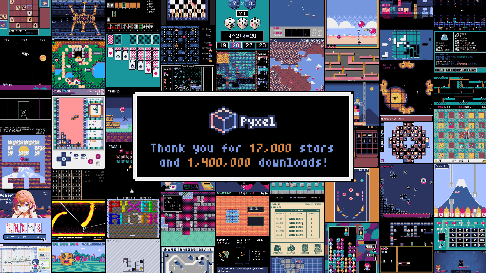
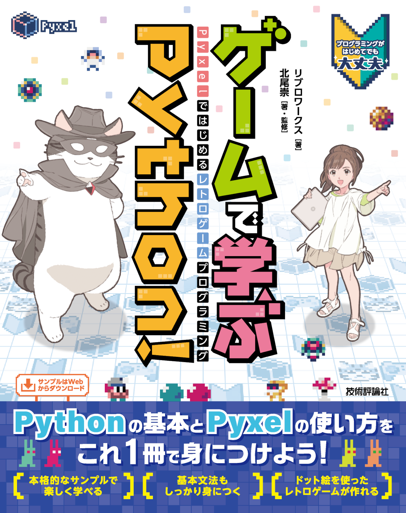
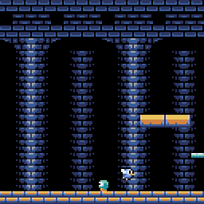
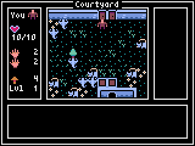
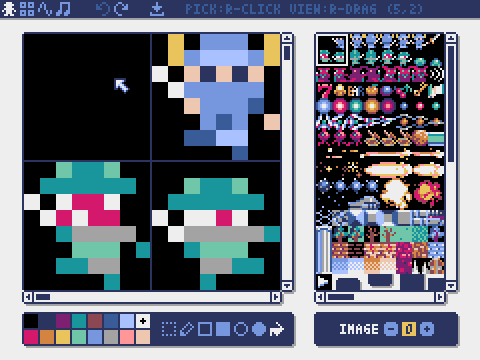
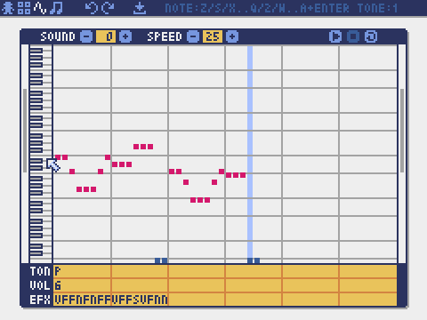
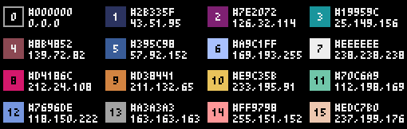

# 

[](https://pypi.org/project/pyxel/)
[](https://github.com/kitao/pyxel)
[](https://github.com/kitao/pyxel)
[](https://github.com/sponsors/kitao)

[](https://ko-fi.com/H2H27VDKD)

[ [English](../README.md) | [中文](README.cn.md) | [Deutsch](README.de.md) | [Español](README.es.md) | [Français](README.fr.md) | [Italiano](README.it.md) | [日本語](README.ja.md) | [한국어](README.ko.md) | [Português](README.pt.md) | [Русский](README.ru.md) | [Türkçe](README.tr.md) | [Українська](README.uk.md) ]

**Pyxel** (/ˈpɪksəl/) 是一个针对 Python 的复古游戏引擎。

其规格受到复古游戏机的启发，例如仅支持 16 种颜色和 4 个声道，同时可以轻松享受制作像素艺术风格游戏的乐趣。

[](https://github.com/kitao/pyxel/wiki/Pyxel-User-Examples) [](https://gihyo.jp/book/2025/978-4-297-14657-3)

Pyxel 的开发得益于用户的反馈。请在 GitHub 上给 Pyxel 点个 Star！

<p>
<a href="https://kitao.github.io/pyxel/wasm/showcase/examples/10-platformer.html">

</a>
<a href="https://kitao.github.io/pyxel/wasm/showcase/apps/30sec-of-daylight.html">

</a>
<a href="https://kitao.github.io/pyxel/wasm/showcase/examples/02-jump-game.html">

</a>
<a href="https://kitao.github.io/pyxel/wasm/showcase/apps/megaball.html">

</a>
<a href="https://kitao.github.io/pyxel/wasm/showcase/tools/image-editor.html">

</a>
<a href="https://kitao.github.io/pyxel/wasm/showcase/tools/sound-editor.html">

</a>
</p>

Pyxel 的规格和 API 参考了 [PICO-8](https://www.lexaloffle.com/pico-8.php) 和 [TIC-80](https://tic80.com/)。

Pyxel 在 [MIT 许可证](../LICENSE) 下开源并免费使用。让我们开始使用 Pyxel 制作复古游戏吧！

## 规格

- 支持 Windows、Mac、Linux 和 Web
- 使用 Python 编程
- 可自定义屏幕尺寸
- 16 色调色板
- 3 个 256x256 图像库
- 8 个 256x256 瓦片地图
- 4 个通道，支持 64 种可定义声音
- 8 个音乐轨道可组合任意声音
- 支持键盘、鼠标和游戏手柄输入
- 图像和声音编辑工具
- 用户可扩展的颜色、声音通道和库

### 色彩调色板




## 如何安装

### Windows / Mac / Linux

安装 [Python 3](https://www.python.org/)（版本 3.8 或更高）后，运行以下命令：

```sh
pip install -U pyxel
```

**注意：** 在 Windows 上，安装 Python 时请确保勾选 `Add python.exe to PATH`，以启用 `pyxel` 命令。

### Web

Web 版 Pyxel 可在 PC、智能手机、平板电脑等具有兼容浏览器的设备上使用，无需安装。

Web 版开发环境 [Pyxel Code Maker](https://kitao.github.io/pyxel/wasm/code-maker/) 只需在浏览器中打开即可使用。

如需在自己的网站中嵌入 Pyxel 应用等其他用法，请参考[此页面](pyxel-web-en.md)。

### VS Code

在 [Visual Studio Code](https://code.visualstudio.com/)（VS Code）中添加 Pyxel 扩展后，无需安装 Python 或 Pyxel 即可开发和运行 Pyxel 应用。

添加 Pyxel 扩展的方法是，在 VS Code 的扩展视图中搜索「[Pyxel](https://marketplace.visualstudio.com/items?itemName=kitao.pyxel-vscode)」，然后点击安装按钮。

## 基本用法

### Pyxel 命令

安装 Pyxel 后即可使用 `pyxel` 命令。在 `pyxel` 后指定命令名称来执行各种操作。

不带参数运行可查看可用命令列表：

```sh
pyxel
```

```
Pyxel, a retro game engine for Python
usage:
    pyxel run PYTHON_SCRIPT_FILE(.py)
    pyxel watch WATCH_DIR PYTHON_SCRIPT_FILE(.py)
    pyxel play PYXEL_APP_FILE(.pyxapp)
    pyxel edit [PYXEL_RESOURCE_FILE(.pyxres)]
    pyxel package APP_DIR STARTUP_SCRIPT_FILE(.py)
    pyxel app2exe PYXEL_APP_FILE(.pyxapp)
    pyxel app2html PYXEL_APP_FILE(.pyxapp)
    pyxel copy_examples
```

### 运行示例

使用以下命令可将 Pyxel 示例复制到当前目录：

```sh
pyxel copy_examples
```

在本地环境中，可以通过以下命令执行示例：

```sh
# 在 examples 目录运行示例
cd pyxel_examples
pyxel run 01_hello_pyxel.py

# 在 examples/apps 目录运行应用
cd apps
pyxel play 30sec_of_daylight.pyxapp
```

示例也可以在 [Pyxel Showcase](https://kitao.github.io/pyxel/wasm/showcase/) 上通过浏览器查看和运行。

## 创建应用程序

### 创建程序

在您的 Python 脚本中导入 Pyxel，通过 `init` 指定窗口大小，然后用 `run` 启动应用程序。

```python
import pyxel

pyxel.init(160, 120)

def update():
    if pyxel.btnp(pyxel.KEY_Q):
        pyxel.quit()

def draw():
    pyxel.cls(0)
    pyxel.rect(10, 10, 20, 20, 11)

pyxel.run(update, draw)
```

`run` 函数的参数是处理帧更新的 `update` 函数和处理屏幕绘制的 `draw` 函数。

在实际应用中，建议将 Pyxel 代码封装在类中，如下所示：

```python
import pyxel

class App:
    def __init__(self):
        pyxel.init(160, 120)
        self.x = 0
        pyxel.run(self.update, self.draw)

    def update(self):
        self.x = (self.x + 1) % pyxel.width

    def draw(self):
        pyxel.cls(0)
        pyxel.rect(self.x, 0, 8, 8, 9)

App()
```

要创建没有动画的简单图形，您可以使用 `show` 函数来简化代码。

```python
import pyxel

pyxel.init(120, 120)
pyxel.cls(1)
pyxel.circb(60, 60, 40, 7)
pyxel.show()
```

### 运行程序

创建的脚本可以使用 `python` 命令执行：

```sh
python PYTHON_SCRIPT_FILE
```

它也可以使用 `pyxel run` 命令运行：

```sh
pyxel run PYTHON_SCRIPT_FILE
```

此外，`pyxel watch` 命令监视指定目录中的更改，并在检测到更改时自动重新运行程序：

```sh
pyxel watch WATCH_DIR PYTHON_SCRIPT_FILE
```

按 `Ctrl(Command)+C` 停止目录监视。

### 特殊键操作

在运行 Pyxel 应用程序时，可以执行以下特殊键操作：

- `Esc`<br>
  退出应用程序
- `Alt(Option)+R` 或者在游戏手柄上按 `A+B+X+Y+BACK`<br>
  重置应用程序
- `Alt(Option)+1`<br>
  将屏幕截图保存到桌面
- `Alt(Option)+2`<br>
  重置屏幕录像视频的录制开始时间
- `Alt(Option)+3`<br>
  将屏幕录像视频保存到桌面（最多 10 秒）
- `Alt(Option)+8` 或者在游戏手柄上按 `A+B+X+Y+DL`<br>
  在最大和整数倍缩放之间切换屏幕缩放
- `Alt(Option)+9` 或者在游戏手柄上按 `A+B+X+Y+DR`<br>
  在屏幕模式 (Crisp/Smooth/Retro) 之间切换
- `Alt(Option)+0` 或者在游戏手柄上按 `A+B+X+Y+DU`<br>
  切换性能监视器 (FPS/`update` 时间/`draw` 时间)
- `Alt(Option)+Enter` 或者在游戏手柄上按 `A+B+X+Y+DD`<br>
  切换全屏
- `Shift+Alt(Option)+1/2/3`<br>
  将图像库 0、1 或 2 保存到桌面
- `Shift+Alt(Option)+0`<br>
  将当前的调色板保存到桌面

## 创建资源

### Pyxel Editor

Pyxel Editor 用于创建 Pyxel 应用程序使用的图像和声音。

详细操作方法请参阅 [Pyxel Editor 手册](https://kitao.github.io/pyxel/wasm/editor-manual/)。

### 其他创建方法

Pyxel 图像和瓦片地图还可以通过以下方法创建：

- 使用 `Image.set` 或 `Tilemap.set` 函数，从字符串列表创建图像或瓦片地图
- 使用 `Image.load` 函数加载适用于 Pyxel 调色板的图像文件 (PNG/GIF/JPEG)

Pyxel 的声音和音乐也可以通过以下方法创建：

- 使用 `Sound.set` 或 `Music.set` 函数从字符串创建

有关这些函数的用法，请参阅 API 参考。

## 分发应用程序

Pyxel 支持一种跨平台分发格式：Pyxel 应用程序文件。

使用 `pyxel package` 命令创建 Pyxel 应用程序文件 (.pyxapp)：

```sh
pyxel package APP_DIR STARTUP_SCRIPT_FILE
```

如果您需要包括资源或其他模块，请将它们放在应用程序目录中。

通过在启动脚本中指定以下格式，可以在运行时显示元数据。除 `title` 和 `author` 外的字段都是可选的。

```python
# title: Pyxel Platformer
# author: Takashi Kitao
# desc: A Pyxel platformer example
# site: https://github.com/kitao/pyxel
# license: MIT
# version: 1.0
```

创建的应用程序文件可以使用 `pyxel play` 命令运行：

```sh
pyxel play PYXEL_APP_FILE
```

Pyxel 应用程序文件还可以使用 `pyxel app2exe` 或 `pyxel app2html` 命令转换为可执行文件或 HTML 文件。

## API 参考

Pyxel 的完整 API 列表请参阅 [Pyxel API 参考](https://kitao.github.io/pyxel/wasm/api-reference/)。

Pyxel 还包含需要专业知识的”高级 API”。在参考页面勾选”Advanced”复选框即可查看。

如果你对自己的技术有信心，不妨尝试使用高级 API 来创作令人惊叹的作品！

## 如何贡献

### 提交问题

使用 [问题跟踪器](https://github.com/kitao/pyxel/issues) 提交 bug 报告和功能或增强请求。在提交新问题之前，请确保没有类似的开放问题。

### 功能测试

任何手动测试代码并在 [问题跟踪器](https://github.com/kitao/pyxel/issues) 中报告 bug 或增强建议的人都非常欢迎！

### 提交拉取请求

补丁和修复以拉取请求 (PR) 的形式接受。请确保拉取请求所针对的问题在问题跟踪器中是开放的。

提交拉取请求意味着您同意根据 [MIT 许可证](../LICENSE) 授权您的贡献。

## 工具与示例

- [Pyxel Showcase](https://kitao.github.io/pyxel/wasm/showcase/)
- [Pyxel API 参考](https://kitao.github.io/pyxel/wasm/api-reference/)
- [Pyxel Editor 手册](https://kitao.github.io/pyxel/wasm/editor-manual/)
- [Pyxel Web Launcher](https://kitao.github.io/pyxel/wasm/launcher/)
- [Pyxel Code Maker](https://kitao.github.io/pyxel/wasm/code-maker/)
- [Pyxel MML Studio](https://kitao.github.io/pyxel/wasm/mml-studio/)
- [VS Code 扩展](https://marketplace.visualstudio.com/items?itemName=kitao.pyxel-vscode)
- [MCP 服务器](https://github.com/kitao/pyxel-mcp)
- [Claude Code 技能](https://github.com/kitao/pyxel-skill)

## 其他信息

- [常见问题](faq-en.md)
- [用户示例](https://github.com/kitao/pyxel/wiki/Pyxel-User-Examples)
- [开发者的 X 帐号](https://x.com/kitao)
- [Discord 服务器（英文）](https://discord.gg/Z87eYHN)
- [Discord 服务器（日文）](https://discord.gg/qHA5BCS)

## 许可证

Pyxel 采用 [MIT 许可证](../LICENSE)。它可以在专有软件中重复使用，前提是所有软件或其重要部分的副本都包含 MIT 许可证条款和版权声明的副本。

## 征募赞助者

Pyxel 在 GitHub Sponsors 上寻找赞助者。请考虑赞助 Pyxel，以支持其持续维护和功能开发。作为一种福利，赞助者可以直接咨询 Pyxel 开发者。有关更多详细信息，请访问 [此页面](https://github.com/sponsors/kitao)。
