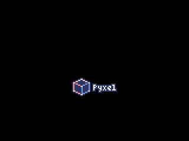
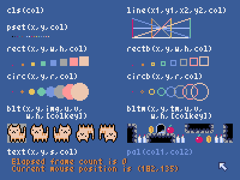
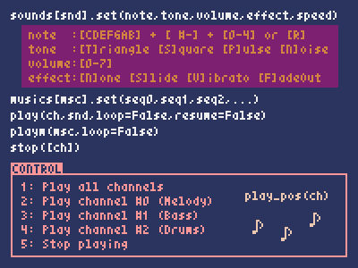
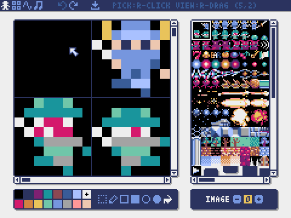
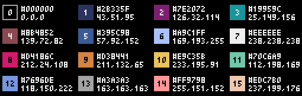
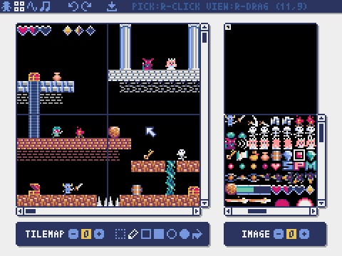
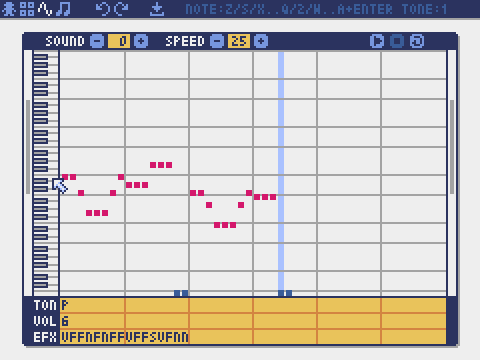
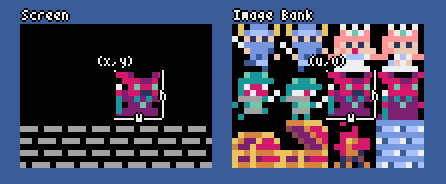
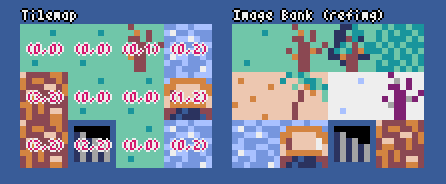

  # 

[](https://pypi.org/project/pyxel/)
[](https://github.com/kitao/pyxel)
[](https://github.com/kitao/pyxel)
[](https://github.com/sponsors/kitao)

[](https://ko-fi.com/H2H27VDKD)

[ [English](../README.md) | [中文](README.cn.md) | [Deutsch](README.de.md) | [Español](README.es.md) | [Français](README.fr.md) | [Italiano](README.it.md) | [日本語](README.ja.md) | [한국어](README.ko.md) | [Português](README.pt.md) | [Русский](README.ru.md) ]

**Pyxel** ist eine Retro-Spielengine für Python.

Dank seiner einfachen, von Retro-Spielkonsolen inspirierten, Spezifikationen, wie z. B. dass nur 16 Farben angezeigt werden können und nur 4 Töne gleichzeitig wiedergegeben werden können, kannst du dich frei fühlen, um Spiele im Pixel-Art-Stil zu entwickeln.

<p>






</p>

Die Spezifikationen und APIs von Pyxel sind inspiriert von [PICO-8](https://www.lexaloffle.com/pico-8.php) und [TIC-80](https://tic80.com/).

Pyxel ist quelloffen und kostenlos zu verwenden. Fang an, ein Retro-Spiel mit Pyxel zu entwickeln!

## Spezifikationen

- Läuft unter Windows, Mac, Linux und Web
- Programming with Python
- 16 color palette
- 3 Image-Banks in der Größe 256x256
- 256x256 große 8 Tilemaps
- 4 Kanäle mit 64 definierbaren Tönen
- 8 Musikspuren, die beliebige Klänge kombinieren können
- Tastatur-, Maus- und Gamepad-Eingaben
- Bild- und Toneditor

### Farbpalette




## Installationsanleitung

### Windows

Nach der Installation von [Python3](https://www.python.org/) (Version 3.7 oder höher), führe folgenden Befehl aus:

```sh
pip install -U pyxel
```

### Mac

Nach der Installation von [Python3](https://www.python.org/) (version 3.7oder höher), führe folgenden Befehl aus:

```sh
pip3 install -U pyxel
```

### Linux

Nach der Installation des SDL2-Packages (`libsdl2-dev` für Ubuntu), [Python3](https://www.python.org/) (version 3.7 oder höher) und `python3-pip`, führe folgenden Befehl aus:

```sh
sudo pip3 install -U pyxel
```

Wenn das oben genannte nicht funktioniert, versuchen Sie, sich selbst gemäß den Anweisungen in [Makefile](../Makefile) zu erstellen.

### Web

Lesen Sie [diese Seite](https://kitao.github.io/pyxel/wasm/) und laden Sie das Pyxel-Skript wie folgt:

```html
<script src="https://cdn.jsdelivr.net/gh/kitao/pyxel/wasm/pyxel.js"></script>
```

### Try Pyxel Examples

Nach der Installation von Pyxel kannst du die Beispiele von Pyxel mit dem folgenden Befehl in das aktuelle Verzeichnis kopieren:

```sh
pyxel copy_examples
```

Die zu kopierenden Beispiele lauten wie folgt:

- [01_hello_pyxel.py](https://kitao.github.io/pyxel/wasm/pages/01_hello_pyxel.html) - Einfaches Fenster
- [02_jump_game.py](https://kitao.github.io/pyxel/wasm/pages/02_jump_game.html) - Spring Spiel mit Pyxel-Ressource-Datei
- [03_draw_api.py](https://kitao.github.io/pyxel/wasm/pages/03_draw_api.html) - Demonstration der Zeichen-APIs
- [04_sound_api.py](https://kitao.github.io/pyxel/wasm/pages/04_sound_api.html) - Demonstration of Sound-APIs
- [05_color_palette.py](https://kitao.github.io/pyxel/wasm/pages/05_color_palette.html) - Farbpalleten Liste
- [06_click_game.py](https://kitao.github.io/pyxel/wasm/pages/06_click_game.html) - Maus-Klick-Spiel
- [07_snake.py](https://kitao.github.io/pyxel/wasm/pages/07_snake.html) - Snake mit BGM
- [08_triangle_api.py](https://kitao.github.io/pyxel/wasm/pages/08_triangle_api.html) - Demonstration of triangle drawing APIs
- [09_shooter.py](https://kitao.github.io/pyxel/wasm/pages/09_shooter.html) - Shoot'em up mit Displayübergängen
- [10_platformer.py](https://kitao.github.io/pyxel/wasm/pages/10_platformer.html) - Side-Scroller Platform Spiel mit Karte
- [11_offscreen.py](https://kitao.github.io/pyxel/wasm/pages/11_offscreen.html) - Offscreen-Rendering mit der Klasse Image
- [12_perlin_noise.py](https://kitao.github.io/pyxel/wasm/pages/12_perlin_noise.html) - Perlin-Lärm-Animation
- [30SecondsOfDaylight.pyxapp](https://kitao.github.io/pyxel/wasm/pages/30SecondsOfDaylight.html) - 1. Pyxel Jam Gewinnspiel von [Adam](https://twitter.com/helpcomputer0)
- [megaball.pyxapp](https://kitao.github.io/pyxel/wasm/pages/megaball.html) - Arcade Ball Physik Spiel von [Adam](https://twitter.com/helpcomputer0)

Führe eines der Beispiele mit folgendem Befehl aus:

```sh
cd pyxel_examples
pyxel run 01_hello_pyxel.py
pyxel play 30SecondsOfDaylight.pyxapp
```

## Verwendung

### Eine Pyxel-Anwendung erstellen

Nachdem du das Pyxel-Modul in Ihr Python-Skript importiert hast, gib zunächst die Fenstergröße mit der Funktion `init` an und starten dann die Pyxel-Anwendung mit der Funktion `run`.

```python
import pyxel

pyxel.init(160, 120)

def update():
    if pyxel.btnp(pyxel.KEY_Q):
        pyxel.quit()

def draw():
    pyxel.cls(0)
    pyxel.rect(10, 10, 20, 20, 11)

pyxel.run(update, draw)
```

Die Argumente der Funktion `run` sind die `update` Funktion, um jedes Bild zu aktualisieren, und die Funktion `draw`, um den Bildschirm bei Bedarf zu zeichnen.

In einer tatsächlichen Anwendung ist es empfehlenswert, den Pyxel-Code in eine Klasse zu verpacken, wie unten dargestellt:

```python
import pyxel

class App:
    def __init__(self):
        pyxel.init(160, 120)
        self.x = 0
        pyxel.run(self.update, self.draw)

    def update(self):
        self.x = (self.x + 1) % pyxel.width

    def draw(self):
        pyxel.cls(0)
        pyxel.rect(self.x, 0, 8, 8, 9)

App()
```

### Pyxel-Anwendung ausführen

Das erstellte Python-Skript kann mit dem folgenden Befehl ausgeführt werden:

```sh
pyxel run PYTHON_SCRIPT_FILE
```

In der Package-Version kann es wie ein normales Python-Skript ausgeführt werden:

```sh
cd pyxel_examples
python3 PYTHON_SCRIPT_FILE
```

(Für Windows, gib `python` anstatt `python3` ein)

### Shortcuts

Die folgenden Shortcuts können eingegeben werden, während eine Pyxel-Anwendung läuft:

- `Esc`<br>
Schließt die Anwendung
- `Alt(Option)+1`<br>
Speichert einen Screenshot zum Desktop
- `Alt(Option)+2`<br>
Setzt die Startzeit für die Aufnahme des Bildschirmaufzeichnung zurück
- `Alt(Option)+3`<br>
Speichert die Bildschirmaufzeichnung zum Desktop (bis zu 10 Sekunden)
- `Alt(Option)+0`<br>
Umschalten des Leistungsmonitors (fps, Updatezeit und Framezeit)
- `Alt(Option)+Enter`<br>
Fullscreen umschalten

### Wie man eine Ressource erstellt

Der Pyxel Editor kann Bilder und Töne erstellen, die in einer Pyxel-Anwendung verwendet werden.

Starte den Editor mit folgendem Befehl:

```sh
pyxel edit [PYXEL_RESOURCE_FILE]
```

Wenn die angegebene Pyxel-Datei (.pyxres) existiert, wird die Datei geladen, wenn nicht, wird eine neue Datei mit dem angegebenen Namen erstellt. Wenn die Datei nicht angegeben wird, lautet der Name my_resource.pyxres.

Nach dem Start des Pyxel-Editors kann die Datei durch Drag-and-Drop einer anderen Ressourcendatei gewechselt werden. Wenn die Taste ``Strg(Cmd)`` während des Drag-and-Drops gedrückt wird, wird nur der Ressourcentyp (Bild/Tilemap/Sound/Musik), der gerade bearbeitet wird, geladen. Das ermöglicht es, mehrere Ressourcendateien zu einer einzigen zu kombinieren.

Die erstellte Ressourcendatei kann mit der Funktion `load` geladen werden.

Der Pyxel Editor hat die folgenden Bearbeitungsmodi

**Bildeditor:**

Der Modus zum Editieren von Image Banks.


Per Drag-and-Drop einer Bild-Datei (png/gif/jpeg) auf das Bildeditor-Fenster kann das Bild in die aktuell ausgewählte Image-Bank geladen werden.

**Tilemap-Editor:**

Der Modus zum editieren von Tilemaps in welcher Bilder aus der Image Bank in einem Tile-Pattern arrangiert sind.



**Sound-Editor:**

Der Modus um Sounds zu editieren.



**Musik-Editor:**

Der Modus um Sounds in Wiedergabereihenfolge zu Musik zusammenzufügen.


### Andere Methoden der Ressourcenerstellung

Pyxel-Bilder und Tilemaps können auch mit den folgenden Methoden erstellt werden:

- Erstelle ein Bild aus einer Liste strings mit der `Image.set` Funktion oder der `Tilemap.set` Funktion.
- Lade eine Bild-Datei (png/gif/jpeg) in die Pyxel-Palette mit der `Image.load` Funktion.

Pyxel-Sounds können auch mit der folgenden Methode erstellt werden:

- Erstelle einen Sound aus einem String mit der `Sound.set` Funktion oder der `Music.set` Funktion.

Bitte lesen Sie die API-Referenz für die Verwendung dieser Funktionen.

### Wie man seine Pyxel-Applikation teilen kann

Pyxel unterstützt ein spezielles Dateiformat für das Teilen von Pyxel-Anwendungen (Pyxel application file), das plattformübergreifend funktioniert.

Erstelle die Pyxel-Anwendungsdatei (.pyxapp) mit folgendem Befehl:

```sh
pyxel package APP_ROOT_DIR STARTUP_SCRIPT_FILE
```

Wenn die Anwendung Ressourcen oder zusätzliche Module enthalten soll, legen Sie diese in den Anwendungsordner.

Die erstellte Anwendungsdatei kann mit dem folgenden Befehl ausgeführt werden:

```sh
pyxel play PYXEL_APP_FILE
```

## API-Referenz

### System

- `width`, `height`<br>
Die Breite und Höhe des Fensters

- `frame_count`<br>
Die Anzahl der bereits gezeigten Bilder

- `init(width, height, [title], [fps], [quit_key], [display_scale], [capture_scale], [capture_sec])`<br>
Initialisiere die Bildschirmgröße der Pyxel-Anwendung  (`width`, `height`). Folgenden kann als Option engegeben werden: den Titel des Fensters mit `title`, die Framerate mit `fps`, die Taste zum Beenden des Programms `quit_key`, den Maßstab der Anzeige mit `display_scale`, den Maßstab der Bildschirmaufnahme mit `capture_scale`, und die maximale Aufnahmezeit des Bildschirmaufnahmevideos mit `capture_sec`.<br>
z.B. `pyxel.init(160, 120, title="My Pyxel App", fps=60, quit_key=pyxel.KEY_NONE, capture_scale=3, capture_sec=0)`

- `run(update, draw)`<br>
Starte das Pyxel-Programm und rufe die Funktion `update` zum Updaten des Bildschirms und die `draw` Funktion zum anzeigen.

- `show()`<br>
Zeige das Fenster und warte bis die `Esc` Taste gedrückt wird.

- `quit()`<br>
Beende das Pyxel-Programm.

### Ressourcen

- `load(filename, [image], [tilemap], [sound], [music])`<br>
Lade die Ressourcen-Datei (.pyxres). Falls ``False`` für den Ressourcentyp angegeben ist (``image/tilemap/sound/music``), wird die Ressource nicht geladen.

### Eingabe
- `mouse_x`, `mouse_y`<br>
Die aktuelle Position der Maus

- `mouse_wheel`<br>
Der aktuelle Wert des Scrollrads

- `btn(key)`<br>
Return `True` falls `key` gedrückt ist, sonst return `False` ([Liste der Schlüsseldefinitionen](../python/pyxel/__init__.pyi))

- `btnp(key, [hold], [repeat])`<br>
Return `True` falls `key` gedrückt ist, sonst return `False`. Wenn `hold` und `repeat` angegeben sind, wird `True` am `repeat` Bildintervall returned, falls `key` für mehr als `hold` Frames gedrückt ist

- `btnr(key)`<br>
Return `True` falls `key` in dem Frame losgelassen wird, sonst return `False`

- `mouse(visible)`<br>
Falls `visible`  `True` ist, zeige den Mauscursor. Falls `False`, verstecke ihn. Obwohl man den Cursor dann nicht sehen kann, wird seine Position geupdated

### Grafiken

- `colors`<br>
Liste der Anzeigefarben der Palette. Die Anzeigefarbe wird durch einen numerischen 24-Bit-Wert angegeben. Verwende `colors.from_list` und `colors.to_list`, um Python-Listen direkt zuzuweisen und abzurufen.<br>
z.B. `org_colors = pyxel.colors.to_list(); pyxel.colors[15] = 0x112233; pyxel.colors.from_list(org_colors)`

- `image(img)`<br>
Bediene die Image-Bank `img` (0-2). (Siehe die Klasse Image)<br>
z.B. `pyxel.image(0).load(0, 0, "title.png")`

- `tilemap(tm)`<br>
Bediene die Tilemap `tm`(0-7) (siehe die Tilemap class)

- `clip(x, y, w, h)`<br>
Setze den Bildausschnitt von (`x`, `y`) zu Breite `w` und Höhe `h`. Setze den Bildausschnitt zurück zum Follbild mit `clip()`

- `camera(x, y)`<br>
Change the upper left corner coordinates of the screen to (`x`, `y`). Reset the upper left corner coordinates to (`0`, `0`) with `camera()`.

- `pal(col1, col2)`<br>
Ersetze Farbe `col1` mit `col2` beim zeichnen. Mit `pal()` lässt sich die Pallete auf die initiale zurücksetzen

- `cls(col)`<br>
Das Fenster mit der Farbe `col` füllen

- `pget(x, y)`<br>
Erhalte den Pixel an der Position (`x`, `y`).

- `pset(x, y, col)`<br>
Zeichne einen Pixel der Farbe `col` an der Position (`x`, `y`)

- `line(x1, y1, x2, y2, col)`<br>
Zeichne eine Linie der Farbe `col` von (`x1`, `y1`) bis (`x2`, `y2`)

- `rect(x, y, w, h, col)`<br>
Zeichne ein Rechteck der Breite `w`, Höhe `h` und Farbe `col` ausgehend von (`x`, `y`)

- `rectb(x, y, w, h, col)`<br>
Zeichne die Umrisse eines Rechtecks der Breite `w`, Höhe `h` und Farbe `col` ausgehend von (`x`, `y`)

- `circ(x, y, r, col)`<br>
Zeichne einen Kreis mit dem Radius `r` und Farbe `col` an der Stelle (`x`, `y`)

- `circb(x, y, r, col)`<br>
Zeichne die Umrisse eines Kreises mit dem Radius `r` und Farbe `col` an der Stelle (`x`, `y`)

- `elli(x, y, w, h, col)`<br>
Zeichne eine Ellipse mit der Breite `w`, der Höhe `h` und der Farbe `col` von (`x`, `y`).

- `ellib(x, y, w, h, col)`<br>
Zeichne den Umriss einer Ellipse der Breite `w`, der Höhe `h` und der Farbe `col` von (`x`, `y`).

- `tri(x1, y1, x2, y2, x3, y3, col)`<br>
Zeichne ein Dreieck mit den Scheitelpunkten (`x1`, `y1`), (`x2`, `y2`), (`x3`, `y3`) und Farbe `col`

- `trib(x1, y1, x2, y2, x3, y3, col)`<br>
Zeichne die Umrisse eines Dreiecks mit den Scheitelpunkten (`x1`, `y1`), (`x2`, `y2`), (`x3`, `y3`) und Farbe `col`

- `fill(x, y, col)`<br>
Zeichne eine Ellipse mit der Breite `w`, der Höhe `h` und der Farbe `col` von (`x`, `y`).

- `blt(x, y, img, u, v, w, h, [colkey])`<br>
Kopiere eine Region der Größe (`w`, `h`) von (`u`, `v`) des Image Banks `img`(0-2) zur Position (`x`, `y`). Falls `w` und/oder `h` negativ ist, wird der Ausschnitt horizontal und/oder vertical gespiegelt. Falls `colkey` angegeben ist, wird der Auschnitt als transparentes Farbe behandelt



- `bltm(x, y, tm, u, v, w, h, [colkey])`<br>
Kopiert den Bereich der Größe (`w`, `h`) von (`u`, `v`) der Tilemap `tm` (0-7) nach (`x`, `y`). Wenn ein negativer Wert für `w` und/oder `h` angegeben wird, wird es horizontal und/oder vertikal umgekehrt. Wenn `colkey` angegeben ist, wird es als transparente Farbe behandelt. Die Größe einer Kachel ist 8x8 Pixel und wird in einer Tilemap als Tupel von `(tile_x, tile_y)` gespeichert.



- `text(x, y, s, col)`<br>
Zeichne einen String `s` der Farbe `col` bei (`x`, `y`)

### Audio

- `sound(snd)`<br>
Bediene den Ton `snd`(0-63). (siehe die Sound class).<br>
z.B. `pyxel.sound(0).speed = 60`

- `music(msc)`<br>
Bediene die Musik `msc`(0-7) (siehe die Music class)

- `play_pos(ch)`<br>
Ermittelt die Tonwiedergabeposition des Kanals `ch` (0-3) als Tupel von `(Ton-Nr., Noten-Nr.)`. Gibt `None` zurück, wenn die Wiedergabe gestoppt ist.

- `play(ch, snd, [tick], [loop])`<br>
Spielt den Ton `snd` (0-63) auf Kanal `ch` (0-3). Die Startposition der Wiedergabe kann durch `tick` (1 tick = 1/120 Sekunden) angegeben werden. Falls `snd` eine Liste ist, wird es in der Reihenfolge abgespielt. Falls `True` für `loop` angeben ist, wird eine Schleifenwiedergabe durchgeführt.

- `playm(msc, [tick], [loop])`<br>
Spielt die Musik `msc` (0-7). Die Startposition der Wiedergabe kann durch `tick` (1 tick = 1/120 Sekunden) angegeben werden. Falls `True` für `loop` angegeben ist, wird eine Schleifenwiedergabe durchgeführt.

- `stop([ch])`<br>
Stoppt die Wiedergabe des angegebenen Kanals `ch` (0-3). `stop()`, um die Wiedergabe aller Kanäle zu stoppen.

### Mathematik

- `ceil(x)`<br>
Gibt die kleinste ganze Zahl größer oder gleich `x` zurück.

- `floor(x)`<br>
Gibt die größte ganze Zahl kleiner oder gleich `x` zurück.

- `sgn(x)`<br>
Gibt 1 zurück, wenn `x` positiv ist, 0, wenn es Null ist, und -1, wenn es negativ ist.

- `sqrt(x)`<br>
Gibt die Quadratwurzel von `x` zurück.

- `sin(deg)`<br>
Gibt den Sinus von `deg` Grad zurück.

- `cos(deg)`<br>
Gibt den Kosinus von `deg` Grad zurück.

- `atan2(y, x)`<br>
Gibt den Arkustangens von `y`/`x` in Grad zurück.

- `rseed(seed: int)`<br>
Setzt den Seed des Zufallszahlengenerators.

- `rndi(a, b)`<br>
Gibt eine zufällige ganze Zahl zurück, die größer oder gleich `a` und kleiner oder gleich `b` ist.

- `rndf(a, b)`<br>
Gibt eine zufällige Dezimalzahl zurück, die größer oder gleich `a` und kleiner oder gleich `b` ist.

- `nseed(seed)`<br>
Setzt den Seed des Perlin-Rauschens.

- `noise(x, [y], [z])`<br>
Gibt den Perlin-Rauschwert für die angegebenen Koordinaten zurück.

### Image Klasse

- `width`, `height`<br>
Die Breite und Höhe des Bildes

- `data`<br>
Die Daten des Bildes (256x256 zweidimensionale list)

- `get(x, y)`<br>
Erhalte die Daten des Bildes an der Position (`x`, `y`)

- `set(x, y, data)`<br>
Setzen des Bildes an (`x`, `y`) durch eine Liste von strings.<br>
z.B. `pyxel.image(0).set(10, 10, ["0123", "4567", "89ab", "cdef"])`

- `load(x, y, filename)`<br>
Lade die Bild-Datei (png/gif/jpeg) at (`x`, `y`).

### Tilemap Klasse

- `width`, `height`<br>
Die Breite und Höhe der Tilemap

- `refimg`<br>
Die von der Tilemap referenzierte Image-Bank (0-2)

- `set(x, y, data)`<br>
Setzen der Tilemap an (`x`, `y`) durch eine Liste von strings.<br>
z.B. `pyxel.tilemap(0).set(0, 0, ["0000 0100 a0b0", "0001 0101 a1b1"])`

- `pget(x, y)`<br>
Gibt die Tile bei (`x`, `y`). Ein Tile ist eine Tuple von `(tile_x, tile_y)`.

- `pset(x, y, tile)`<br>
Zeichne eine `tile` bei (`x`, `y`). Ein Tile ist eine Tuple von `(tile_x, tile_y)`.

### Sound Klasse

- `notes`<br>
Liste der Noten (0-127). Je höher die Zahl, desto höher die Tonhöhe, und bei 33 wird sie zu "A2" (440Hz). Der Rest ist -1.

- `tones`<br>
Liste der Töne (0:Triangle/ 1:Square / 2:Pulse / 3: Noise)

- `volumes`<br>
Liste von Lautstärken (0-7)

- `effects`<br>
Liste von Effekten (0:None / 1:Slide / 2:Vibrato / 3:FadeOut)

- `speed`<br>
Abspielgeschwindigkeit. 1 ist die schnellste, und je größer die Zahl, desto langsamer die Wiedergabegeschwindigkeit. Bei 120 entspricht die Länge einer Note 1 Sekunde.

- `set(notes, tones, volumes, effects, speed)`<br>
Legt Noten, Töne, Lautstärken und Effekte mit einer Zeichenfolge fest. Wenn die Länge der Töne, Lautstärken und Effekte kürzer ist als die der Noten, wird sie von Anfang an wiederholt.

- `set_notes(notes)`<br>
Setzt die Noten mit einem string aus 'CDEFGAB'+'#-'+'0123' oder 'R'. Groß- und Kleinschreibung sowie Leerzeichen werden ignoriert.<br>
z.B. `pyxel.sound(0).set_notes("G2B-2D3R RF3F3F3")`

- `set_tones(tones)`<br>
Setzt die Töne mit einem string aus 'TSPN'. Groß- und Kleinschreibung sowie Leerzeichen werden ignoriert.<br>
z.B. `pyxel.sound(0).set_tones("TTSS PPPN")`

- `set_volumes(volumes)`<br>
Setzt die Lautstärke mit einer Zeichenkette aus '01234567'.  Groß- und Kleinschreibung sowie Leerzeichen werden ignoriert.<br>
z.B. `pyxel.sound(0).set_volumes("7777 7531")`

- `set_effects(effects)`<br>
Setzt die Effekte mit einer Zeichenkette aus 'NSVF'. Groß- und Kleinschreibung sowie Leerzeichen werden ignoriert.<br>
z.B. `pyxel.sound(0).set_effects("NFNF NVVS")`

### Musik Klasse

- `snds_list`<br>
Zweidimensionale Liste von Klängen (0-63) mit der Anzahl der Kanäle.

- `set(snds0, snds1, snds2, snds3)`<br>
Setzt die Tonlisten (0-63) für alle Kanäle fest. Wenn eine leere Liste angegeben wird, wird dieser Kanal nicht für die Wiedergabe verwendet.<br>
z.B. `pyxel.music(0).set([0, 1], [2, 3], [4], [])`

### Advanced APIs

Pyxel verfügt über "fortgeschrittene APIs", die in dieser Referenz nicht erwähnt werden, weil sie "Benutzer verwirren können" oder "spezielles Wissen zur Nutzung erfordern".

Wenn du mit deinen Fähigkeiten vertraut bist, versuche [hiermit](../python/pyxel/__init__.pyi) als Anhaltspunkt erstaunliche Werke zu schaffen!

## Wie du beitragen kannst

### Ein Issue einreichen

Verwende den [Issue Tracker] (https://github.com/kitao/pyxel/issues), um Fehlerberichte und Funktions-/Erweiterungswünsche einzureichen. Vergewissere dich vor dem Einreichen eines neuen Problems, dass es kein ähnliches offenes Problem gibt.

### Manuelles Testen

Jeder, der den Code manuell testet und Fehler oder Verbesserungsvorschläge im [Issue Tracker](https://github.com/kitao/pyxel/issues) meldet, ist herzlich willkommen!

### Pull Request einreichen

Patches/Fixes werden in Form von Pull Requests (PRs) akzeptiert. Stellen Sie sicher, dass das Problem, auf das sich der Pull Request bezieht, im Issue Tracker offen ist.

Bei einem eingereichten Pull-Request wird davon ausgegangen, dass der Veröffentlichung unter der [MIT Lizenz](../LICENSE) zugestimmt wird.

## Weitere Informationen

- [Q&A](https://github.com/kitao/pyxel/wiki/Pyxel-Q&A)
- [User Examples](https://github.com/kitao/pyxel/wiki/Pyxel-User-Examples)
- [Discord Server (English)](https://discord.gg/Z87eYHN)
- [Discord Server (Japanese - 日本語版)](https://discord.gg/qHA5BCS)

## Lizenz

Pyxel steht unter der [MIT-Lizenz](../LICENSE). Es kann innerhalb proprietärer Software wiederverwendet werden, vorausgesetzt, dass alle Kopien der Software oder ihrer wesentlichen Teile eine Kopie der Bedingungen der MIT-Lizenz und auch einen Copyright-Hinweis enthalten.

## Sponsoren Werben

Pyxel sucht Sponsoren auf GitHub Sponsors. Ziehen Sie in Erwägung, Pyxel für die fortlaufende Wartung und Funktionserweiterungen zu sponsern. Sponsoren können sich über Pyxel als Vorteil beraten. Weitere Informationen finden Sie [hier](https://github.com/sponsors/kitao).
