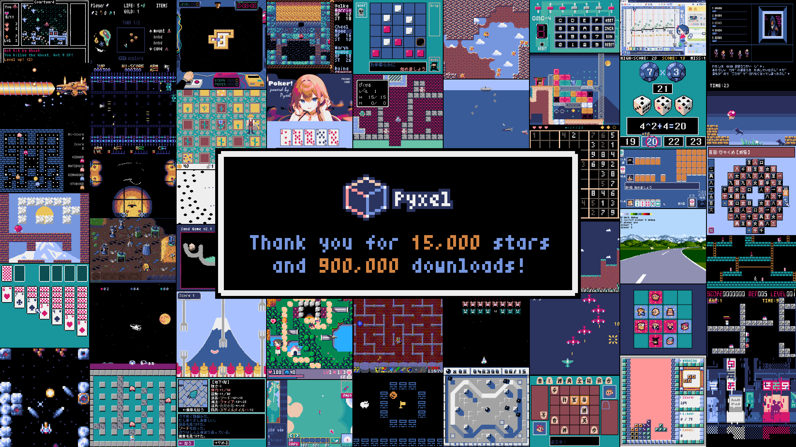

# 

[](https://pypi.org/project/pyxel/)
[](https://github.com/kitao/pyxel)
[](https://github.com/kitao/pyxel)
[](https://github.com/sponsors/kitao)

[](https://ko-fi.com/H2H27VDKD)

[ [English](../README.md) | [中文](README.cn.md) | [Deutsch](README.de.md) | [Español](README.es.md) | [Français](README.fr.md) | [Italiano](README.it.md) | [日本語](README.ja.md) | [한국어](README.ko.md) | [Português](README.pt.md) | [Русский](README.ru.md) | [Türkçe](README.tr.md) | [Українська](README.uk.md) ]

**Pyxel** est un moteur de jeu vidéo rétro pour Python.

Grâce à ses spécifications simples inspirées par les consoles rétro, comme le fait que seulement 16 couleurs peuvent être affichées et que seulement 4 sons peuvent être lus en même temps, vous pouvez vous sentir libre de créer des jeux vidéo dans le style pixel art.



La motivation pour le développement de Pyxel est le feedback des utilisateurs. Veuillez donner une étoile à Pyxel sur GitHub !

<p>
<a href="https://kitao.github.io/pyxel/wasm/examples/01_hello_pyxel.html">

</a>
<a href="https://kitao.github.io/pyxel/wasm/examples/02_jump_game.html">

</a>
<a href="https://kitao.github.io/pyxel/wasm/examples/03_draw_api.html">

</a>
<a href="https://kitao.github.io/pyxel/wasm/examples/04_sound_api.html">

</a>
<a href="https://kitao.github.io/pyxel/wasm/examples/image_editor.html">

</a>
<a href="https://kitao.github.io/pyxel/wasm/examples/sound_editor.html">

</a>
</p>

Les spécifications et les API de Pyxel sont inspirées de [PICO-8](https://www.lexaloffle.com/pico-8.php) et [TIC-80](https://tic80.com/).

Pyxel est un logiciel libre et open source. Commençons à faire un jeu vidéo rétro avec Pyxel !

## Spécifications

- Fonctionne sur Windows, Mac, Linux et Web
- Programmable en Python
- Palette de 16 couleurs
- 3 banques d’images de taille 256x256
- 8 tilemaps (niveaux ou scènes) de taille 256x256
- 4 canaux avec 64 sons configurables
- 8 musiques pouvant combiner des sons arbitraires
- Entrées clavier, souris et manettes
- Éditeur d’images et de sons

### Palette de couleurs


## Comment installer

### Windows

Après avoir installé [Python3](https://www.python.org/) (version 3.8 ou plus), lancez la commande suivante :

```sh
pip install -U pyxel
```

Si vous installez Python à l'aide de l'installateur officiel, veuillez cocher la case `Add Python 3.x to PATH` pour activer la commande `pyxel`.

### Mac

Après avoir installé [Homebrew](https://brew.sh/), exécutez les commandes suivantes :

```sh
brew install pipx
pipx ensurepath
pipx install pyxel
```

Pour mettre à jour la version après avoir installé Pyxel, exécutez `pipx upgrade pyxel`.

### Linux

Après avoir installé le paquet SDL2 (`libsdl2-dev` pour Ubuntu), [Python3](https://www.python.org/) (version 3.8 ou plus), et `python3-pip`, lancez la commande suivante :

```sh
sudo pip3 install -U pyxel
```

Si ce qui précède ne fonctionne pas, essayez l'autoconstruction en suivant les instructions de [Makefile](../Makefile).

### Web

La version web de Pyxel ne nécessite pas d'installation de Python ou de Pyxel et fonctionne aussi bien sur les PC que sur les smartphones et tablettes avec des navigateurs web pris en charge.

Pour des instructions spécifiques, veuillez vous référer à [cette page](https://github.com/kitao/pyxel/wiki/How-To-Use-Pyxel-Web).

### Lancer les exemples de Pyxel

Après l’installation de Pyxel, les exemples de Pyxel seront copiés dans le répertoire courant avec la commande suivante :

```sh
pyxel copy_examples
```

Les exemples copiés sont les suivants :

<table>
<tr>
<td>01_hello_pyxel.py</td>
<td>Application simple</td>
<td><a href="https://kitao.github.io/pyxel/wasm/examples/01_hello_pyxel.html">Demo</a></td>
<td><a href="https://github.com/kitao/pyxel/blob/main/python/pyxel/examples/01_hello_pyxel.py">Code</a></td>
</tr>
<tr>
<td>02_jump_game.py</td>
<td>Jeu de saut avec les fichiers de ressources Pyxel</td>
<td><a href="https://kitao.github.io/pyxel/wasm/examples/02_jump_game.html">Demo</a></td>
<td><a href="https://github.com/kitao/pyxel/blob/main/python/pyxel/examples/02_jump_game.py">Code</a></td>
</tr>
<tr>
<td>03_draw_api.py</td>
<td>Démonstration de l’API de dessin</td>
<td><a href="https://kitao.github.io/pyxel/wasm/examples/03_draw_api.html">Demo</a></td>
<td><a href="https://github.com/kitao/pyxel/blob/main/python/pyxel/examples/03_draw_api.py">Code</a></td>
</tr>
<tr>
<td>04_sound_api.py</td>
<td>Démonstration de l’API de son</td>
<td><a href="https://kitao.github.io/pyxel/wasm/examples/04_sound_api.html">Demo</a></td>
<td><a href="https://github.com/kitao/pyxel/blob/main/python/pyxel/examples/04_sound_api.py">Code</a></td>
</tr>
<tr>
<td>05_color_palette.py</td>
<td>Liste des couleurs de la palette</td>
<td><a href="https://kitao.github.io/pyxel/wasm/examples/05_color_palette.html">Demo</a></td>
<td><a href="https://github.com/kitao/pyxel/blob/main/python/pyxel/examples/05_color_palette.py">Code</a></td>
</tr>
<tr>
<td>06_click_game.py</td>
<td>Jeu de type pointer et cliquer</td>
<td><a href="https://kitao.github.io/pyxel/wasm/examples/06_click_game.html">Demo</a></td>
<td><a href="https://github.com/kitao/pyxel/blob/main/python/pyxel/examples/06_click_game.py">Code</a></td>
</tr>
<tr>
<td>07_snake.py</td>
<td>Jeu du Snake avec une bande son</td>
<td><a href="https://kitao.github.io/pyxel/wasm/examples/07_snake.html">Demo</a></td>
<td><a href="https://github.com/kitao/pyxel/blob/main/python/pyxel/examples/07_snake.py">Code</a></td>
</tr>
<tr>
<td>08_triangle_api.py</td>
<td>Démonstration de l’API de dessin de triangle</td>
<td><a href="https://kitao.github.io/pyxel/wasm/examples/08_triangle_api.html">Demo</a></td>
<td><a href="https://github.com/kitao/pyxel/blob/main/python/pyxel/examples/08_triangle_api.py">Code</a></td>
</tr>
<tr>
<td>09_shooter.py</td>
<td>Jeu de shoot'em up avec changement d’écran</td>
<td><a href="https://kitao.github.io/pyxel/wasm/examples/09_shooter.html">Demo</a></td>
<td><a href="https://github.com/kitao/pyxel/blob/main/python/pyxel/examples/09_shooter.py">Code</a></td>
</tr>
<tr>
<td>10_platformer.py</td>
<td>Jeu de plateforme avec défilement horizontal et une carte</td>
<td><a href="https://kitao.github.io/pyxel/wasm/examples/10_platformer.html">Demo</a></td>
<td><a href="https://github.com/kitao/pyxel/blob/main/python/pyxel/examples/10_platformer.py">Code</a></td>
</tr>
<tr>
<td>11_offscreen.py</td>
<td>Rendu hors écran avec la classe Image</td>
<td><a href="https://kitao.github.io/pyxel/wasm/examples/11_offscreen.html">Demo</a></td>
<td><a href="https://github.com/kitao/pyxel/blob/main/python/pyxel/examples/11_offscreen.py">Code</a></td>
</tr>
<tr>
<td>12_perlin_noise.py</td>
<td>Animation du bruit de Perlin</td>
<td><a href="https://kitao.github.io/pyxel/wasm/examples/12_perlin_noise.html">Demo</a></td>
<td><a href="https://github.com/kitao/pyxel/blob/main/python/pyxel/examples/12_perlin_noise.py">Code</a></td>
</tr>
<tr>
<td>13_bitmap_font.py</td>
<td>Dessiner une police bitmap</td>
<td><a href="https://kitao.github.io/pyxel/wasm/examples/13_bitmap_font.html">Demo</a></td>
<td><a href="https://github.com/kitao/pyxel/blob/main/python/pyxel/examples/13_bitmap_font.py">Code</a></td>
</tr>
<tr>
<td>14_synthesizer.py</td>
<td>Synthétiseur utilisant des fonctions d'expansion audio</td>
<td><a href="https://kitao.github.io/pyxel/wasm/examples/14_synthesizer.html">Demo</a></td>
<td><a href="https://github.com/kitao/pyxel/blob/main/python/pyxel/examples/14_synthesizer.py">Code</a></td>
</tr>
<tr>
<td>15_tiled_map_file.py</td>
<td>Chargement et dessin d'un fichier de carte carrelée (.tmx)</td>
<td><a href="https://kitao.github.io/pyxel/wasm/examples/15_tiled_map_file.html">Demo</a></td>
<td><a href="https://github.com/kitao/pyxel/blob/main/python/pyxel/examples/15_tiled_map_file.py">Code</a></td>
</tr>
<tr>
<td>16_transform.py</td>
<td>Rotation et mise à l'échelle de l'image</td>
<td><a href="https://kitao.github.io/pyxel/wasm/examples/16_transform.html">Demo</a></td>
<td><a href="https://github.com/kitao/pyxel/blob/main/python/pyxel/examples/16_transform.py">Code</a></td>
</tr>
<tr>
<td>99_flip_animation.py</td>
<td>Animation avec la fonction flip (plateformes non-web uniquement)</td>
<td><a href="https://github.com/kitao/pyxel/blob/main/docs/images/99_flip_animation.gif">Demo</a></td>
<td><a href="https://github.com/kitao/pyxel/blob/main/python/pyxel/examples/99_flip_animation.py">Code</a></td>
</tr>
<tr>
<td>30SecondsOfDaylight.pyxapp</td>
<td>1er jeu gagnant du Pyxel Jam par <a href="https://x.com/helpcomputer0">Adam</a></td>
<td><a href="https://kitao.github.io/pyxel/wasm/examples/30SecondsOfDaylight.html">Demo</a></td>
<td><a href="https://github.com/kitao/30SecondsOfDaylight">Code</a></td>
</tr>
<tr>
<td>megaball.pyxapp</td>
<td>Jeu physique de balles d'arcade par <a href="https://x.com/helpcomputer0">Adam</a></td>
<td><a href="https://kitao.github.io/pyxel/wasm/examples/megaball.html">Demo</a></td>
<td><a href="https://github.com/helpcomputer/megaball">Code</a></td>
</tr>
<tr>
<td>8bit-bgm-gen.pyxapp</td>
<td>Générateur de musique de fond fait par <a href="https://x.com/frenchbread1222">frenchbread</a></td>
<td><a href="https://kitao.github.io/pyxel/wasm/examples/8bit-bgm-gen.html">Demo</a></td>
<td><a href="https://github.com/shiromofufactory/8bit-bgm-generator">Code</a></td>
</tr>
</table>

Les exemples peuvent être lancés avec les commandes suivantes :

```sh
cd pyxel_examples
pyxel run 01_hello_pyxel.py
pyxel play 30SecondsOfDaylight.pyxapp
```

## Comment utiliser

### Créer une application Pyxel

Après avoir importé le module Pyxel dans votre script Python, spécifiez d’abord la taille de la fenêtre avec la fonction `init`, puis lancez l’application Pyxel avec la fonction `run`.

```python
import pyxel

pyxel.init(160, 120)

def update():
    if pyxel.btnp(pyxel.KEY_Q):
        pyxel.quit()

def draw():
    pyxel.cls(0)
    pyxel.rect(10, 10, 20, 20, 11)

pyxel.run(update, draw)
```

Les arguments de la fonction `run` sont la fonction `update` pour mettre à jour chaque frame et la fonction `draw` pour dessiner sur l’écran quand c’est nécessaire.

Dans une vraie application, il est recommandé de mettre le code Pyxel dans une classe comme ci-dessous :

```python
import pyxel

class App:
    def __init__(self):
        pyxel.init(160, 120)
        self.x = 0
        pyxel.run(self.update, self.draw)

    def update(self):
        self.x = (self.x + 1) % pyxel.width

    def draw(self):
        pyxel.cls(0)
        pyxel.rect(self.x, 0, 8, 8, 9)

App()
```

Lors de la création de graphiques simples sans animation, la fonction `show` peut être utilisée pour rendre le code plus concis.

```python
import pyxel

pyxel.init(120, 120)
pyxel.cls(1)
pyxel.circb(60, 60, 40, 7)
pyxel.show()
```

### Lancer une application Pyxel

Un script Python créé peut être exécuté à l'aide de la commande `python` :

```sh
python PYTHON_SCRIPT_FILE
```

Il peut également être exécuté avec la commande `pyxel run` :

```sh
pyxel run PYTHON_SCRIPT_FILE
```

De plus, la commande `pyxel watch` permet de surveiller les changements dans un répertoire spécifié, et de relancer automatiquement le programme lorsque des changements sont détectés :

```sh
pyxel watch WATCH_DIR PYTHON_SCRIPT_FILE
```

La surveillance des répertoires peut être arrêtée en appuyant sur `Ctrl(Command)+C`.

### Contrôles spéciaux

Les contrôles spéciaux suivants peuvent être lancés pendant qu’une application Pyxel tourne :

- `Esc`<br>
  Quitte l’application
- `Alt(Option)+1`<br>
  Sauvegarde la capture d’écran sur le bureau
- `Alt(Option)+2`<br>
  Réinitialise le temps de départ de la capture vidéo
- `Alt(Option)+3`<br>
  Sauvegarde la capture d’écran sur le bureau (jusqu’à 10 secondes)
- `Alt(Option)+9`<br>
  Passer d'un mode d'écran à l'autre (Crisp, Smooth, Retro)
- `Alt(Option)+0`<br>
  Bascule vers le moniteur de performance (fps, temps de mise à jour et temps de dessin)
- `Alt(Option)+Enter`<br>
  Met en plein écran
- `Shift+Alt(Option)+1/2/3`<br>
  Enregistrer la banque d'images correspondante sur le bureau
- `Shift+Alt(Option)+0`<br>
  Enregistrer la palette de couleurs actuelle sur le bureau

### Comment créer une ressource

L’éditeur Pyxel peut créer des images et des sons utilisables dans des applications Pyxel.

Il se lance avec la commande suivante :

```sh
pyxel edit PYXEL_RESOURCE_FILE
```

Si le fichier de ressource Pyxel (.pyxres) existe déjà, le fichier est chargé, sinon, un nouveau fichier avec le nom indiqué est créé. Si le fichier de ressource n’est pas spécifié, le nom est `my_resource.pyxres`.

Après avoir lancé l’éditeur Pyxel, le fichier peut être changé en glissant-dépossant un autre fichier de ressource.

La ressource créée peut être chargée avec la fonction `load`.

L’éditeur Pyxel a les modes suivants.

**Éditeur d’images **

Mode pour éditer les banques d’images.

<a href="https://kitao.github.io/pyxel/wasm/examples/image_editor.html">

</a>

Glisser-déposer un fichier image (PNG/GIF/JPEG) dans l'éditeur d'images pour charger l'image dans la banque d'images actuellement sélectionnée.

**Éditeur de tilemap **

Mode pour éditer les tilemaps, dans lesquelles les images des banques d’images sont ordonnées en motifs de tuiles.

<a href="https://kitao.github.io/pyxel/wasm/examples/tilemap_editor.html">

</a>

Glisser-déposer un fichier TMX (Tiled Map File) dans l'éditeur de mosaïques pour charger sa couche dans l'ordre de dessin correspondant au numéro de la mosaïque sélectionnée.

**Éditeur de sons **

Mode pour éditer les sons.

<a href="https://kitao.github.io/pyxel/wasm/examples/sound_editor.html">

</a>

**Éditeur de musiques **

Mode pour éditer les musiques dans lesquelles les sons sont ordonnés par ordre de lecture.

<a href="https://kitao.github.io/pyxel/wasm/examples/music_editor.html">

</a>

### Autres méthodes pour créer des ressources

Les images et tilemaps Pyxel peuvent être aussi créées avec les méthodes suivantes :

- Créer une image depuis une liste de chaînes de caractères avec la fonction `Image.set` ou la fonction `Tilemap.set`
- Charger une image (PNG/GIF/JPEG) dans la palette Pyxel avec la fonction `Image.load`

Les sons Pyxel peuvent aussi être créés avec la méthode suivante :

- Créer un son à partir d’une chaîne de caractères avec la fonction `Sound.set` ou la fonction `Music.set`

Référez vous à la documentation de l’API pour l’utilisation de ces fonctions.

### Comment partager une application

Pyxels a un format de fichier spécifique (fichier d’application Pyxel) qui fonctionne sur les différentes plateformes.

Créez le fichier d'application Pyxel (.pyxapp) avec la commande `pyxel package` :

```sh
pyxel package APP_DIR STARTUP_SCRIPT_FILE
```

Si l'application doit inclure des ressources ou des modules supplémentaires, placez-les dans le répertoire de l'application.

Le fichier d'application créé peut être exécuté avec la commande `pyxel play` :

```sh
pyxel play PYXEL_APP_FILE
```

Le fichier d'application Pyxel peut aussi être converti en un exécutable ou un fichier HTML avec les commandes `pyxel app2exe` ou `pyxel app2html`.

## Documentation de l’API

### Système

- `width`, `height`<br>
  La largeur et la hauteur de l’écran

- `frame_count`<br>
  Le nombre de frames passées

- `init(width, height, [title], [fps], [quit_key], [display_scale], [capture_scale], [capture_sec])`<br>
  Initialise l’application Pyxel avec un écran de taille (`width`, `height`). Il est possible de passer comme options : le titre de la fenêtre avec `title`, le nombre d’images par seconde avec `fps`, la touche pour quitter l’application avec `quit_key`, l'échelle de l'affichage avec `display_scale`, l’échelle des captures d’écran avec `capture_scale`, et le temps maximum d’enregistrement vidéo avec `capture_sec`.<br>
  Par exemple : `pyxel.init(160, 120, title="My Pyxel App", fps=60, quit_key=pyxel.KEY_NONE, capture_scale=3, capture_sec=0)`

- `run(update, draw)`<br>
  Lance l’application Pyxel et appelle la fonction `update` et la fonction `draw`.

- `show()`<br>
  Affiche l’écran jusqu’à ce que la touche `Esc` soit appuyée.

- `flip()`<br>
  Rafraîchit l'écran d'une image. L'application se termine lorsque la touche `Esc` est pressée. Cette fonction ne fonctionne pas dans la version web.

- `quit()`<br>
  Quitte l’application Pyxel.

### Ressources

- `load(filename, [excl_images], [excl_tilemaps], [excl_sounds], [excl_musics])`<br>
  Charge la ressource (.pyxres). Si une option est `True`, la ressource ne sera pas chargée. Si un fichier de palette (.pyxpal) du même nom existe au même endroit que le fichier de ressource, la couleur d'affichage de la palette sera également modifiée. Le fichier de palette est une entrée hexadécimale des couleurs d'affichage (par exemple `1100FF`), séparée par des nouvelles lignes. Le fichier de palette peut également être utilisé pour changer les couleurs affichées dans l'éditeur Pyxel.

### Entrées

- `mouse_x`, `mouse_y`<br>
  La position actuelle du curseur de la souris

- `mouse_wheel`<br>
  La valeur actuelle de la molette de la souris

- `btn(key)`<br>
  Renvoie `True` si la touche `key` est appuyée, sinon renvoie `False`. ([liste des touches](../python/pyxel/__init__.pyi))

- `btnp(key, [hold], [repeat])`<br>
  Renvoie `True` si la touche `key` est appuyée à cette frame, sinon renvoie `False`. Quand `hold` et `repeat` sont spécifiés, `True` sera renvoyé à l’intervalle de frame `repeat` quand la touche `key` est appuyée pendant plus de `hold` frames.

- `btnr(key)`<br>
  Renvoie `True` si la touche `key` est relâchée à cette frame, sinon renvoie `False`

- `mouse(visible)`<br>
  Si `visible` est `True`, affiche le curseur de la souris. Si `False`, le curseur est caché. Même si le curseur n’est pas affiché, sa position est actualisée.

### Graphiques

- `colors`<br>
  Liste les couleurs de la palette. Les couleurs sont spécifiées avec une valeur 24-bit. Vous pouvez utiliser `colors.from_list` et `colors.to_list` pour directement donner et recevoir une liste Python.<br>
  Par exemple `old_colors = pyxel.colors.to_list(); pyxel.colors.from_list([0x111111, 0x222222, 0x333333]); pyxel.colors[15] = 0x112233`

- `images`<br>
  Liste des banques d'images (0-2). (Voir la classe Image)<br>
  Par exemple `pyxel.images[0].load(0, 0, "title.png")`

- `tilemaps`<br>
  Liste des cartes de tuiles (0-7). (voir la classe Tilemap)

- `clip(x, y, w, h)`<br>
  Défini la zone de dessin (`x`, `y`) avec une largeur `w` et une hauteur `h`. Réinitialiser la zone de dessin au plein écran avec `clip()`

- `camera(x, y)`<br>
  Change the upper left corner coordinates of the screen to (`x`, `y`). Reset the upper left corner coordinates to (`0`, `0`) with `camera()`.

- `pal(col1, col2)`<br>
  Remplace la couleur `col1` avec `col2` au dessin. `pal()` pour réinitialiser la palette de couleurs.

- `dither(alpha)`<br>
  Applique le tramage (pseudo-transparence) au dessin. Fixe `alpha` dans l'intervalle 0.0-1.0, où 0.0 est transparent et 1.0 est opaque.

- `cls(col)`<br>
  Efface l’écran avec la couleur `col`

- `pget(x, y)`<br>
  Renvoie la couleur au pixel (`x`, `y`).

- `pset(x, y, col)`<br>
  Dessine un pixel de couleur `col` à (`x`, `y`).

- `line(x1, y1, x2, y2, col)`<br>
  Dessine une ligne de couleur `col` de (`x1`, `y1`) à (`x2`, `y2`).

- `rect(x, y, w, h, col)`<br>
  Dessine un rectangle de largeur `w`, de hauteur `h` et de couleur `col` à partir de (`x`, `y`).

- `rectb(x, y, w, h, col)`<br>
  Dessine les contours d’un rectangle de largeur `w`, de hauteur `h` et de couleur `col` à partir de (`x`, `y`).

- `circ(x, y, r, col)`<br>
  Dessine un cercle de rayon `r` et de couleur `col` à (`x`, `y`).

- `circb(x, y, r, col)`<br>
  Dessine le contour d’un cercle de rayon `r` et de couleur `col` à (`x`, `y`).

- `elli(x, y, w, h, col)`<br>
  Dessinez une ellipse de largeur `w`, de hauteur `h` et de couleur `col` à partir de (`x`, `y`).

- `ellib(x, y, w, h, col)`<br>
  Dessinez le contour d'une ellipse de largeur `w`, de hauteur `h` et de couleur `col` à partir de (`x`, `y`).

- `tri(x1, y1, x2, y2, x3, y3, col)`<br>
  Dessine un triangle avec les sommets (`x1`, `y1`), (`x2`, `y2`), (`x3`, `y3`) et de couleur `col`

- `trib(x1, y1, x2, y2, x3, y3, col)`<br>
  Dessine les contours d’un triangle avec les sommets (`x1`, `y1`), (`x2`, `y2`), (`x3`, `y3`) et de couleur `col`

- `fill(x, y, col)`<br>
  Dessine une ellipse de largeur `w`, de hauteur `h` et de couleur `col` à partir de (`x`, `y`).

- `blt(x, y, img, u, v, w, h, [colkey], [rotate], [scale])`<br>
  Copie la région de taille (`w`, `h`) de (`u`, `v`) de la banque d’image `img`(0-2) à (`x`, `y`). Si une valeur négative est mise pour `w`(ou `h`), la copie sera inversée horizontalement (ou verticalement). Si `colkey` est spécifiée, elle sera traitée comme une couleur transparente. Si `rotate`(en degrés), `scale`(1.0=100%), ou les deux sont spécifiés, la transformation correspondante sera appliquée.


- `bltm(x, y, tm, u, v, w, h, [colkey], [rotate], [scale])`<br>
  Copie la région de taille (`w`, `h`) de (`u`, `v`) de la tilemap `tm`(0-7) à (`x`, `y`). Si une valeur négative est mise pour `w`(ou `h`), la copie sera inversée horizontalement (ou verticalement). Si `colkey` est spécifiée, elle sera traitée comme une couleur transparente. Si `rotate`(en degrés), `scale`(1.0=100%), ou les deux sont spécifiés, la transformation correspondante sera appliquée. La taille d’une tuile est 8x8 pixels et elle est storée dans une tilemap en tant que paire `(tile_x, tile_y)`.


- `text(x, y, s, col)`<br>
  Dessine une chaîne de caractères `s` de couleur `col` à (`x`, `y`).

### Audio

- `sounds`<br>
  Liste des sons (0-63). (voir la classe Sound)<br>
  par exemple : `pyxel.sounds[0].speed = 60`

- `musics`<br>
  Liste des musiques (0-7). (voir la classe Music)

- `play(ch, snd, [tick], [loop], [resume])`<br>
  Joue le son `snd`(0-63) sur le canal `ch`(0-3). Si `snd` est une liste, les sons seront joués dans l’ordre. La position de début de lecture peut être spécifiée par `tick`(1 tick = 1/120 secondes). Si `loop` est à `True`, le son est joué en boucle. Pour reprendre le son précédent après la fin de la lecture, définissez `resume` sur `True`.

- `playm(msc, [tick], [loop])`<br>
  Joue la musique `msc`(0-7). La position de début de lecture peut être spécifiée par `tick`(1 tick = 1/120 secondes). Si `loop` est mis à `True`, la musique est joué en boucle.

- `stop([ch])`<br>
  Arrête le son du canal spécifié `ch`(0-3). `stop()` arrête tous les canaux.

- `play_pos(ch)`<br>
  Récupère la position du son du canal `ch`(0-3) comme un tuple `(sound no, note no)`. Renvoie `None` quand le son est arrêté.

### Mathématiques

- `ceil(x)`<br>
  Renvoie le plus petit nombre entier supérieur ou égal à `x`.

- `floor(x)`<br>
  Renvoie le plus grand nombre entier inférieur ou égal à `x`.

- `sgn(x)`<br>
  Renvoie 1 lorsque `x` est positif, 0 lorsqu'il est nul, et -1 lorsqu'il est négatif.

- `sqrt(x)`<br>
  Renvoie la racine carrée de `x`.

- `sin(deg)`<br>
  Renvoie le sinus de `deg` degrés.

- `cos(deg)`<br>
  Renvoie le cosinus de `deg` degrés.

- `atan2(y, x)`<br>
  Retourne l'arctangente de `y`/`x` en degrés.

- `rseed(seed)`<br>
  Définit la graine du générateur de nombres aléatoires.

- `rndi(a, b)`<br>
  Renvoie un nombre entier aléatoire supérieur ou égal à `a` et inférieur ou égal à `b`.

- `rndf(a, b)`<br>
  Renvoie une décimale aléatoire supérieure ou égale à `a` et inférieure ou égale à `b`.

- `nseed(seed)`<br>
  Définit la graine du bruit de Perlin.

- `noise(x, [y], [z])`<br>
  Renvoie la valeur du bruit de Perlin pour les coordonnées spécifiées.

### Classe Image

- `width`, `height`<br>
  La largeur et la hauteur d’une image

- `set(x, y, data)`<br>
  Met la valeur de l’image à (`x`, `y`) suivant une liste de chaînes.<br>
  Par exemple `pyxel.images[0].set(10, 10, ["0123", "4567", "89ab", "cdef"])`

- `load(x, y, filename)`<br>
  Charge l’image (PNG/GIF/JPEG) à (`x`, `y`).

- `pget(x, y)`<br>
  Renvoie la couleur au pixel (`x`, `y`).

- `pset(x, y, col)`<br>
  Dessine un pixel de couleur `col` à (`x`, `y`).

### Classe Tilemap

- `width`, `height`<br>
  La largeur et la hauteur de la tilemap

- `imgsrc`<br>
  La banque d’image (0-2) référencée par la tilemap

- `set(x, y, data)`<br>
  Met la tilemap à (`x`, `y`) suivant une liste de chaînes.<br>
  Par exemple `pyxel.tilemap(0).set(0, 0, ["0000 0100 a0b0", "0001 0101 a1b1"])`

- `load(x, y, filename, layer)`<br>
  Chargez la couche dans l'ordre de dessin `couche`(0-) à partir du fichier TMX (Tiled Map File) à (`x`, `y`).

- `pget(x, y)`<br>
  Renvoie la tile à (`x`, `y`). Une tile est un tuple `(tile_x, tile_y)`.

- `pset(x, y, tile)`<br>
  Dessine une `tile` à (`x`, `y`). Une tile est un tuple `(tile_x, tile_y)`.

### Classe Sound

- `notes`<br>
  Liste des notes (0-127). Plus le nombre est haut, plus la note est haute, et à 33 ça devient 'A2' (440Hz). Le reste est à -1.

- `tones`<br>
  Liste les tons (0:Triangle / 1:Square / 2:Pulse / 3:Noise)

- `volumes`<br>
  Liste les volumes (0-7)

- `effects`<br>
  Liste les effets (0:None / 1:Slide / 2:Vibrato / 3:FadeOut / 4:Half-FadeOut / 5:Quarter-FadeOut)

- `speed`<br>
  Vitesse de lecture. 1 est le plus rapide, et plus le nombre est grand, plus la vitesse est lente. à 120, la longueur d’une note est de 1 second.

- `set(notes, tones, volumes, effects, speed)`<br>
  Met les valeurs de notes, tones, volumes et effects avec une chaîne. Si les tons, volumes et effets sont plus courts que les notes, ils sont répétés depuis le début.

- `set_notes(notes)`<br>
  Met les notes avec une chaîne de 'CDEFGAB'+'#-'+'01234' ou 'R'. Insensible à la casse et les espaces sont ignorés.<br>
  Par exemple `pyxel.sounds[0].set_notes("G2B-2D3R RF3F3F3")`

- `set_tones(tones)`<br>
  Met les tons avec une chaîne de 'TSPN'. Insensible à la casse et les espaces sont ignorés.<br>
  Par exemple `pyxel.sounds[0].set_tones("TTSS PPPN")`

- `set_volumes(volumes)`<br>
  Met les volumes avec une chaîne de '01234567'. Insensible à la casse et les espaces sont ignorés.<br>
  Par exemple `pyxel.sounds[0].set_volumes("7777 7531")`

- `set_effects(effects)`<br>
  Met les effets avec une chaîne de 'NSVFHQ'. Insensible à la casse et les espaces sont ignorés.<br>
  Par exemple `pyxel.sounds[0].set_effects("NFNF NVVS")`

### Classe Music

- `seqs`<br>
  Liste bidimensionnelle de sons (0-63) avec le nombre de canaux

- `set(seq0, seq1, seq2, ...)`<br>
  Régler les listes de sons (0-63) des canaux. Si une liste vide est passée, ce canal n’est pas utilisé.<br>
  Par exemple `pyxel.musics[0].set([0, 1], [], [3])`

### API avancée

Pyxel a une "API avancée" qui n’est pas présentée ici car elle peut porter à confusion ou qu’elle nécessite des connaissances spécifiques pour être utilisée.

Si vous savez ce que vous faîtes, essayez de créer des applications incroyables avec [ceci](../python/pyxel/__init__.pyi) comme indice !

## Comment contribuer

### En ouvrant des tickets

Utilisez [l’outil de suivi de tickets](https://github.com/kitao/pyxel/issues) pour signaler des bugs et demander des nouvelles fonctionnalités ou des améliorations. Avant d’ouvrir un nouveau ticket, regardez si un similaire n’a pas déjà été ouvert.

### Tester manuellement

Toutes les personnes testant le code et rapportant des bugs ou des suggestions d’améliorations dans [l’outil de suivi de tickets](https://github.com/kitao/pyxel/issues) sont les bienvenues!

### En ouvrant des pull requests

Les correctifs sont acceptés sous forme de pull requests (PRs). Faites attention à ce que le ticket que la pull request corrige soit toujours ouvert.

En proposant une pull request, vous acceptez qu’elle soit publiée sous la [licence MIT](../LICENSE).

## Autres informations

- [QUESTIONS ET RÉPONSES](https://github.com/kitao/pyxel/wiki/Pyxel-Q&A)
- [Exemples d'utilisateurs](https://github.com/kitao/pyxel/wiki/Pyxel-User-Examples)
- [Compte du développeur X](https://x.com/kitao)

## License

Pyxel est sous [licence MIT](../LICENSE). Pyxel peut être réutilisé dans un logiciel propriétaire à condition que toutes les copies du logiciel sous licence comprennent une copie des termes de la licence MIT et de l'avis de copyright.

## Recrutement de Sponsors

Pyxel recherche des sponsors sur GitHub Sponsors. Envisagez de parrainer Pyxel pour une maintenance continue et des ajouts de fonctionnalités. Les sponsors peuvent consulter sur Pyxel comme un avantage. Veuillez voir [ici](https://github.com/sponsors/kitao) pour plus de détails.
